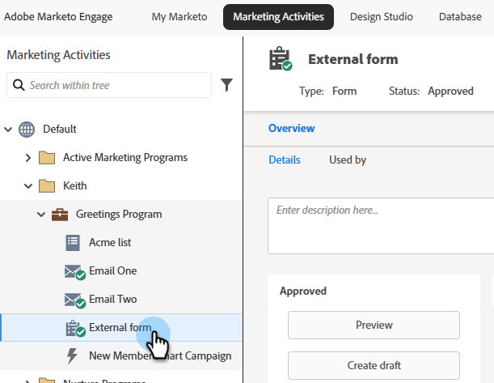
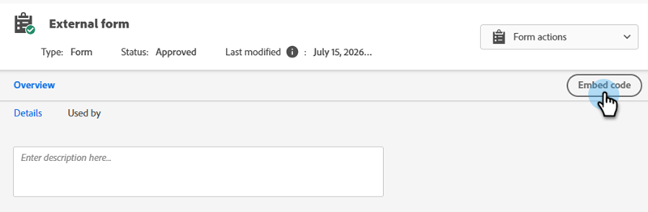

# Incorporare un modulo nel sito web {#embed-a-form-on-your-website}

Accedi al codice di incorporamento di un modulo per ospitarlo sul tuo sito web.

>[!PREREQUISITES]
>
>Affinché il codice di incorporamento sia disponibile, il modulo deve essere approvato.

1. Individuare e selezionare il modulo desiderato.

   

1. A destra della schermata dei dettagli del modulo, fare clic su **[!UICONTROL Embed code]**.

   

   >[!CAUTION]
   >
   >**[Precompilazione modulo](/help/marketo/product-docs/administration/settings/edit-landing-page-settings.md)** non funziona quando si utilizza il codice di incorporamento modulo nelle proprie pagine _o_ una pagina di destinazione di Marketo. La precompilazione del modulo funziona solo quando il modulo viene utilizzato in una pagina di destinazione di Marketo tramite l’opzione Inserisci elemento.

1. Nella scheda _Standard_, fare clic su **[!UICONTROL Copy Text]**. Al termine, fai clic su **[!UICONTROL Close]**.

   

   >[!NOTE]
   >
   >Per il codice Lightbox, vedere [Utilizzare un modulo in un Lightbox](/help/marketo/product-docs/demand-generation/forms/form-actions/use-a-form-in-a-lightbox.md).

1. Dai il codice da incorporare al tuo sviluppatore web.

   Una volta incorporato il codice nel sito web, eventuali modifiche al modulo in Marketo Engage verranno inviate al sito al momento dell’approvazione. Non è necessario apportare modifiche al codice.

   >[!TIP]
   >
   >Se lo sviluppatore desidera personalizzare l&#39;aspetto o accedere alle funzioni API avanzate, visualizzare la [pagina per sviluppatori di Forms 2.0](https://experienceleague.adobe.com/en/docs/marketo-developer/marketo/javascriptapi/forms-api-reference).
