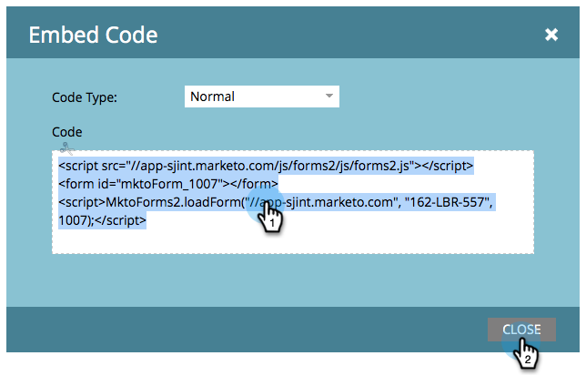

# Incorporare un modulo nel sito web {#embed-a-form-on-your-website}

Marketo consente di incorporare i moduli sul sito Web. Ecco come accedere al codice da incorporare.

1. Passa a **[!UICONTROL Marketing Activities]**.

   

1. Individuare e selezionare il modulo.

   

1. In **[!UICONTROL Form Actions]**, fare clic su **[!UICONTROL Embed Code]**.

   >[!NOTE]
   >
   >Il modulo deve essere approvato affinché l&#39;elemento **[!UICONTROL Embed Code]** sia visibile/utilizzabile.

   

   >[!CAUTION]
   >
   >**[Precompilazione modulo](/help/marketo/product-docs/administration/settings/edit-landing-page-settings.md)** non funziona quando si utilizza il codice di incorporamento modulo nelle proprie pagine _o_ una pagina di destinazione di Marketo. La precompilazione del modulo funziona solo quando il modulo viene utilizzato in una pagina di destinazione di Marketo tramite l’opzione Inserisci elemento.

1. Selezionare/copiare il codice di incorporamento, quindi fare clic su **[!UICONTROL Close]**.

   

>[!TIP]
>
>Una volta incorporato il codice nel sito web, eventuali modifiche al modulo in Marketo verranno inviate al sito al momento dell’approvazione del modulo. Non è necessario apportare ulteriori modifiche al codice.

Ora è sufficiente fornire il codice da incorporare al tuo sviluppatore web e chiedere loro di aggiungerlo al sito.

>[!NOTE]
>
>Se lo sviluppatore desidera personalizzare l&#39;aspetto o accedere alle funzioni API avanzate, visualizzare la [pagina per sviluppatori di Forms 2.0](https://experienceleague.adobe.com/it/docs/marketo-developer/marketo/javascriptapi/forms-api-reference).

Per il codice Lightbox, vedere [Utilizzare un modulo in un Lightbox](/help/marketo/product-docs/demand-generation/forms/form-actions/use-a-form-in-a-lightbox.md).
