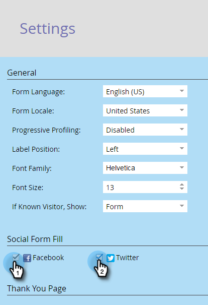

# Abilitare la compilazione di un modulo di contatto in un modulo {#enable-social-form-fill-on-a-form}

Consenti ai visitatori di compilare il modulo utilizzando il proprio social network. Riceverai automaticamente dati aggiuntivi e l’esperienza sarà più rapida.

>[!AVAILABILITY]
>
>Non tutti gli utenti di Marketo Engage hanno acquistato questa funzionalità. Per informazioni, contatta il team dell’account di Adobe (il tuo Account Manager).

1. Vai a **[!UICONTROL Marketing Activities]**.

   

1. Selezionare il modulo e fare clic su **[!UICONTROL Edit Form]**.

   

1. In **[!UICONTROL Form Settings]** fare clic su **[!UICONTROL Settings]**.

   

1. Selezionare i pulsanti del social network che si desidera includere.

   

   >[!TIP]
   >
   >Dai un&#39;occhiata ai dati che _Marketo acquisirà_ se gli utenti utilizzano i pulsanti social.

1. Fai clic su **[!UICONTROL Finish]**.

   

1. Fai clic su **[!UICONTROL Approve and Close]**.

   

   Eccolo.

   

Fantastico, eh?
