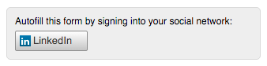

# Domande frequenti sul riempimento dei moduli di linkedIn Social {#linkedin-social-form-fill-faqs}

La politica API rivista di linkedIn ci ha richiesto di rimuovere LinkedIn Social Form Fill dal nostro prodotto.

## Cose importanti da sapere {#important-things-to-know}

* I pulsanti di linkedIn Social Form Fill (Riempimento modulo social) non erano più un’opzione da aggiungere a Marketo il 28 aprile 2016

* È stato rimosso il pulsante di compilazione del modulo LinkedIn Social da tutti i moduli che lo avevano abilitato

## Perché questa funzionalità è stata rimossa dall’abbonamento a Marketo? {#why-was-this-functionality-removed-from-my-marketo-subscription}

linkedIn ha apportato alcune modifiche significative al proprio programma per sviluppatori. Come parte di queste modifiche, Marketo non è più in grado di supportare questa funzionalità per i clienti.

## Cos’è successo se non ho rimosso i pulsanti di LinkedIn Social Form Fill dai miei moduli che avevano abilitato il modulo per social network? {#what-happened-if-i-didnt-remove-the-linkedin-social-form-fill-buttons-from-my-forms-that-had-social-form-enabled}

Il 28 aprile 2016 è stato rimosso il pulsante LinkedIn Social Form Fill dai moduli che avevano ancora il modulo Social abilitato.

## Questa funzionalità è stata inserita nei moduli da quando siamo diventati un cliente Marketo. Come faccio a sapere quali moduli utilizzavano la funzione di compilazione dei moduli di LinkedIn Social? {#i-have-been-inserting-this-functionality-on-forms-since-we-became-a-marketo-customer-how-do-i-know-which-forms-were-using-linkedin-social-form-fill}

Prima di apportare questa modifica, abbiamo inviato notifiche settimanali alla Posta in arrivo delle notifiche con un elenco di moduli che utilizzavano la funzione di compilazione del modulo LinkedIn Social. Questi avvisi sono stati pensati per aiutarti a identificare dove utilizzi questa funzionalità.

## I pulsanti Condivisione social di LinkedIn funzionano ancora? {#do-linkedin-social-sharing-buttons-still-work}

Sì. La modifica interessa solo la funzionalità di compilazione del modulo LinkedIn Social.

## La compilazione dei moduli social di Facebook e Twitter continua a funzionare? {#do-facebook-and-twitter-social-form-fill-still-work}

Sì. Il riempimento del modulo facebook e Twitter Social non è stato modificato.

## È successo qualcosa ai dati già acquisiti tramite LinkedIn Social Form Fill? {#did-anything-happen-to-the-data-we-already-captured-via-linkedin-social-form-fill}

No, questi dati erano già memorizzati nel record persona in Marketo e non erano influenzati da questa modifica.

## Dove posso trovare ulteriori informazioni sui criteri API di LinkedIn? {#where-can-i-find-more-information-about-linkedin-s-api-policy}

Per ulteriori informazioni sulle modifiche apportate da LinkedIn ai criteri API, consulta questo collegamento: [https://developer.linkedin.com/blog/posts/2015/developer-program-changes](https://developer.linkedin.com/blog/posts/2015/developer-program-changes)

## Come posso contattare LinkedIn con le domande? {#how-can-i-contact-linkedin-with-questions}

Segui questo collegamento per contattare LinkedIn per maggiori informazioni sulle soluzioni Marketing: [https://business.linkedin.com/marketing-solutions/contact-us](https://business.linkedin.com/marketing-solutions/contact-us)

## Se Marketo ha rimosso questa funzionalità dai miei moduli il 28 aprile, i miei moduli e le relative pagine di destinazione sono stati messi in modalità bozza? {#if-marketo-removed-this-functionality-from-my-forms-on-april-were-my-forms-and-the-affected-landing-pages-put-into-draft-mode}

No, i moduli che abbiamo rimosso questa funzionalità sono rimasti pubblicati.

## Se LinkedIn è stata la mia unica rete selezionata, verrà modificato l’aspetto del modulo? {#if-linkedin-was-my-only-selected-network-will-this-change-the-appearance-of-my-form}

No, verrà rimosso solo il pulsante LinkedIn dal modulo. Ogni volta che si applica il Compila modulo social a un modulo, sopra di esso è presente un contenitore contenente i pulsanti Riempimento modulo social . Prima del 28 aprile 2016, se LinkedIn era l’unica opzione, l’aspetto del contenitore era simile a questa immagine:

Dopo il 28 aprile 2016, è ora disponibile un contenitore vuoto nella parte superiore di qualsiasi modulo in cui è stato rimosso il riempimento del modulo LinkedIn Social:

>[!NOTE]
>
>Le immagini di cui sopra sono solo per esempio. Potrebbe non essere esattamente così che viene eseguito il rendering del contenitore del pulsante di compilazione del modulo social. Qualsiasi colore, stile e così via del font. hai scelto di influenzare l’aspetto del contenitore.

## Se LinkedIn è stata la mia unica rete selezionata, come posso rimuovere il contenitore vuoto sopra il modulo? {#if-linkedin-was-my-only-selected-network-how-can-i-remove-the-empty-container-above-my-form}

È possibile rimuovere il contenitore vuoto modificando il modulo, selezionando Facebook o Twitter come opzione per il riempimento del modulo social, quindi deselezionando Facebook o Twitter come opzione per il riempimento del modulo social. In questo modo verranno ripristinate le opzioni social all’interno del contenitore di compilazione del modulo e rimosse dal modulo.
