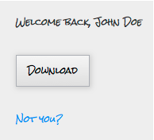

# Mostra modulo HTML personalizzato per persone conosciute {#show-custom-html-form-for-known-people}

Se un visitatore ha fornito il proprio nome completo e indirizzo e-mail in passato e non si desidera che riceva l&#39;intero modulo, scopri come mostrargli un HTML personalizzato (ad esempio, solo un scaricare pulsante).

1. Vai ad Attività&#x200B;**di** marketing.

   

1. In **Attività** marketing selezionare il modulo e fare clic su **Modifica modulo**.

   

1. In **Impostazioni** modulo, fare clic su **Impostazioni**.

   

1. Imposta se **visitatore conosciuto, Mostra**: su **HTML** personalizzato.

   

1. Fai clic su  per modificare il **codice HTML** personalizzato che verrà mostrato alle persone conosciute.

   

1. C&#39;è qualche contenuto predefinita, ma sentiti gratuito di cambiarla.

   

   Token disponibili:

   | Token | Descrizione |
   |---|---|
   | `{{lead.FirstName}}` | Verrà visualizzato il nome della persona. |
   | `{{lead.LastName}}` | Verrà visualizzato il cognome della persona. |
   | `{{form.Button:default=Download}}` | Il modulo verrà visualizzato pulsante. Sostituisci l&#39;area dopo il per `=` modificare il testo pulsante. |
   | `{{form.NotYou:default=Not you?}}` | Verrà visualizzato un collegare nel caso in cui la persona sia qualcun altro. Sostituisci l&#39;area dopo il per `=` modificare il testo collegare. |

   >[!CAUTION]
   >
   >È possibile utilizzare solo i quattro token di cui sopra. Qualsiasi altro token non funzionerà qui.

1. Fai clic su **Fine**.

   

1. Fai clic su **Approva e Chiudi**.

   >[!NOTE]
   >
   >Il modulo deve essere approvato per essere utilizzato nelle pagine di destinazione.

   

   >[!NOTE]
   >
   >Ricordati di [approvare la bozza](/help/marketo/product-docs/demand-generation/landing-pages/understanding-landing-pages/approve-unapprove-or-delete-a-landing-page.md) della pagina di destinazione creata dalle modifiche al modulo.

   Gioco da ragazzi! Scopri cosa vedrebbe una persona se tornasse allo stesso modulo:

   

   >[!TIP]
   >
   >È possibile indirizzare il clic del pulsante al risorsa impostando la pagina di seguire up del modulo sul URL del file.
