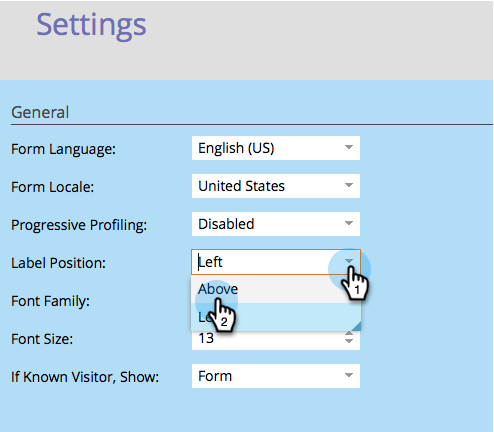

# Cambia posizione etichetta modulo {#change-form-label-position}

Quando [creazione di un modulo](/help/marketo/product-docs/demand-generation/forms/creating-a-form/create-a-form.md), è possibile modificare molto facilmente la posizione delle etichette dei campi modulo. Ecco come.

1. Vai a **Attività di marketing**.

   

1. Seleziona il modulo e fai clic su **Modifica modulo**.

   

1. Seleziona **Impostazioni**.

   

1. Seleziona la **Posizione etichetta** tu vuoi.

   

   Al momento sono disponibili due opzioni:

   * Sinistra (impostazione predefinita)
   * Sopra

1. Clic **Fine**.

   

1. Clic **Approva e chiudi**.

   >[!NOTE]
   >
   >Il modulo deve essere approvato per essere utilizzato nelle pagine di destinazione.

   

   >[!NOTE]
   >
   >Ricorda di approvare la bozza della pagina di destinazione creata dalle modifiche del modulo.

Ben fatto! È facile modificare le posizioni delle etichette in un modulo? OK, vediamo cosa si può fare per cambiare il font delle etichette dei moduli.

>[!MORELIKETHIS]
>
>[Modificare la famiglia di caratteri del modulo](/help/marketo/product-docs/demand-generation/forms/form-design/change-the-form-font-family.md)
