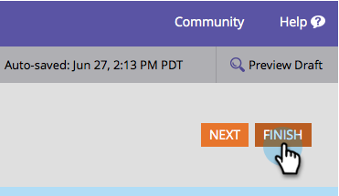
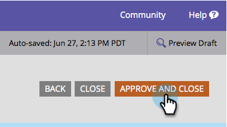

# Modifica testo pulsante invio modulo {#change-form-submit-button-text}

È possibile cambiare in modo rapido e semplice il pulsante di un modulo da &quot;Invia&quot; a qualsiasi altra parola. Ecco come.

1. Vai a **[!UICONTROL Marketing Activities]**.

   

1. Selezionare il modulo e fare clic su **[!UICONTROL Edit Form]**.

   

1. Selezionare il pulsante e modificare **[!UICONTROL Label]**.

   

   >[!TIP]
   >
   >È inoltre possibile modificare l&#39;etichetta di attesa. Questo viene visualizzato dopo aver fatto clic sul pulsante e prima del completamento dell’azione di invio del modulo.

1. Fare clic su **[!UICONTROL Finish]**.

   

1. Fare clic su **[!UICONTROL Approve and Close]**.

   

   
