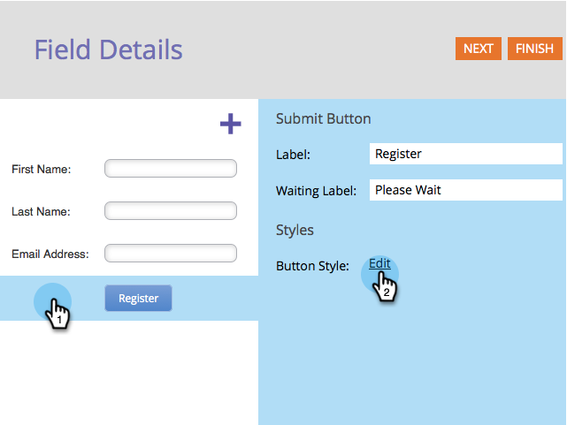
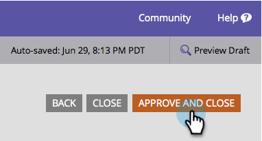

# Modifica stile e colore pulsante Invia {#change-submit-button-style-and-color}

Se trovi il pulsante di invio standard toro, o se hai bisogno di qualcosa di più fantasia, puoi scegliere tra un&#39;ampia gamma di stili di pulsante pronti all&#39;uso.

1. Vai a **Attività di marketing**.

   

1. Seleziona il modulo e fai clic su **Modifica modulo**.

   

1. Seleziona la **Invia** e fai clic su **Modifica** accanto a Stile pulsante.

   

   >[!TIP]
   >
   >Lo sapevi che è possibile trascinare il pulsante di invio a sinistra o a destra per modificarne la posizione? È così facile. Provatela!

1. Selezionare lo stile del pulsante desiderato (scorrere verso l&#39;alto o verso il basso).

   

1. È possibile lasciare il colore come predefinito o personalizzarlo.

   

   >[!TIP]
   >
   >Puoi anche inserire manualmente il codice del colore.

1. Fai clic su **Seleziona**.

   

1. Fai clic su **Fine**.

   

1. Fai clic su **Approva e chiudi**.

   

   Ecco qua!

   

   >[!NOTE]
   >
   >Come molti elementi grafici, il pulsante può avere un aspetto diverso a seconda del browser in uso.
