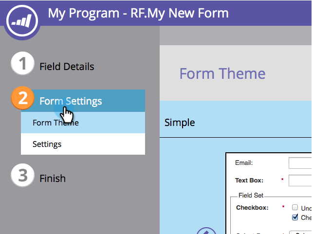
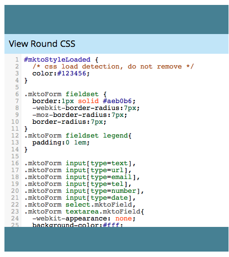

# Modificare il CSS del tema di un modulo {#edit-the-css-of-a-form-theme}

Hai alcuni [temi predefiniti tra cui puoi scegliere](/help/marketo/product-docs/demand-generation/forms/creating-a-form/select-a-form-theme.md). Ma se ti piace modificare i CSS, puoi apportare le modifiche desiderate. Ecco come.

>[!NOTE]
>
>Se desideri provare, assicurati di conoscere i file CSS, in quanto il supporto Marketo non è configurato per assistere nella codifica personalizzata. Inoltre, le modifiche apportate verranno applicate solo al modulo che si sta modificando.

1. Passa a **[!UICONTROL Marketing Activities]**.

   

1. Selezionare il modulo e fare clic su **[!UICONTROL Edit Form]**.

   

1. Passa a **[!UICONTROL Form Settings]**.

   

1. Selezionare il tema che si desidera modificare.

   

1. Sotto l&#39;icona ingranaggio, fare clic su **[!UICONTROL View Theme CSS]**.

   

1. Puoi copiare questo CSS nel tuo editor personale. È di sola lettura, quindi sarà necessario solo il CSS di sostituzione.

   

1. Fai clic su **[!UICONTROL Close]**.

   

1. Sotto l&#39;icona ingranaggio, fare clic su **[!UICONTROL Edit Custom CSS]**.

   

1. Inserisci il CSS personalizzato. Non ne avete bisogno di tutte, solo di parti che sono diverse.

   

1. Al termine, fare clic su **[!UICONTROL Save]**.

   

1. Per visualizzare il modulo personalizzato, fare clic su **[!UICONTROL Preview Draft]**.

   
