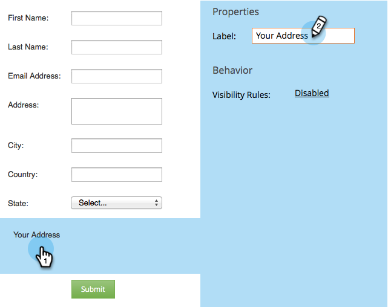
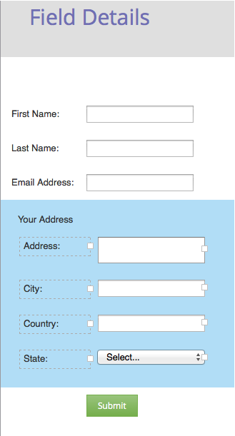

# Aggiungere un set di campi a un modulo {#add-a-fieldset-to-a-form}

I set di campi sono freddi. Raggruppano un mucchio di campi insieme. Puoi anche controllare un intero blocco contemporaneamente!

1. Vai a **Attività di marketing**.

   

1. Seleziona il modulo e fai clic su **Modifica modulo**.

   

1. Fai clic sul pulsante **+** firma e seleziona **Modo**.

   

1. Seleziona la **fielldità** e immetti un **Etichetta**.

   

1. Trascina i campi desiderati nella **fielldità**.

   

1. Ecco come dovrebbe essere fatto.

   

Ecco qua!

>[!TIP]
>
>È possibile nascondere/mostrare in modo dinamico l’intero campo a seconda di un altro campo. Scopri [regole di visibilità](/help/marketo/product-docs/demand-generation/forms/form-fields/dynamically-toggle-visibility-of-a-form-field.md).
