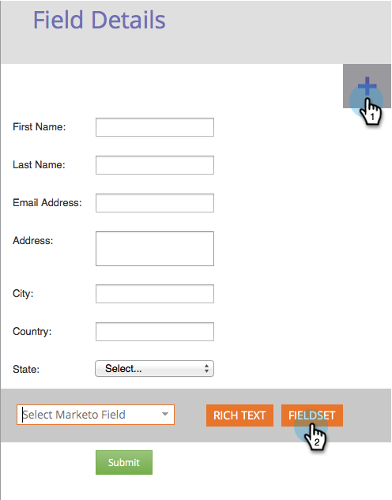

# Aggiungere un set di campi a un modulo {#add-a-fieldset-to-a-form}

I campi sono fantastici. Raggruppano un mucchio di campi. Puoi anche controllare un intero blocco contemporaneamente!

1. Vai a **Attività di marketing**.

   

1. Seleziona il modulo e fai clic su **Modifica modulo**.

   

1. Fai clic su **+** firma e seleziona **Set di campi**.

   

1. Seleziona la **set di campi** e inserisci un **Etichetta**.

   

1. Trascinare i campi desiderati in **set di campi**.

   

1. Ecco come dovrebbe apparire una volta fatto.

   

Eccolo!

>[!TIP]
>
>Puoi nascondere/mostrare in modo dinamico l’intero set di campi a seconda di un altro campo. Informazioni su [regole di visibilità](/help/marketo/product-docs/demand-generation/forms/form-fields/dynamically-toggle-visibility-of-a-form-field.md).
