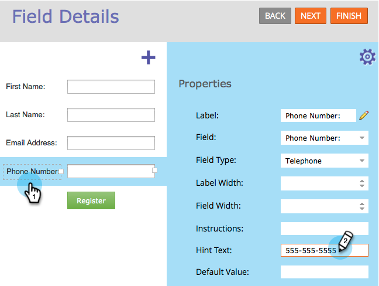

# Aggiunta di testo di suggerimento a un campo modulo {#add-hint-text-to-a-form-field}

Suggerimenti [istruzioni](/help/marketo/product-docs/demand-generation/forms/form-fields/add-tooltip-instructions-to-a-form-field.md) aiutare le persone a compilare i moduli. Ecco come aggiungere un suggerimento.

>[!NOTE]
>
>**Definizione**
>
>Modulo **Suggerimenti** è un testo all’interno del campo che scompare quando il visitatore inizia a digitare nel campo.
>
>Modulo **Istruzioni** sono piccole descrizioni a comparsa quando il visitatore passa il mouse sul campo.

1. Vai a **Attività di marketing**.

   

1. Seleziona il modulo e fai clic su **Modifica modulo**.

   

1. Seleziona il campo e immetti il tuo **Testo suggerimento**.

   

1. Fai clic su **Fine**.

   

1. Fai clic su **Approva e chiudi**.

   

   >[!NOTE]
   >
   >Non dimenticarti di [approva la bozza della pagina di destinazione](/help/marketo/product-docs/demand-generation/landing-pages/understanding-landing-pages/approve-unapprove-or-delete-a-landing-page.md) creato dalle modifiche al modulo.

   

Guardate! Andiamo avanti e aggiungiamo un po&#39; [istruzioni](add-tooltip-instructions-to-a-form-field.md) ora.
