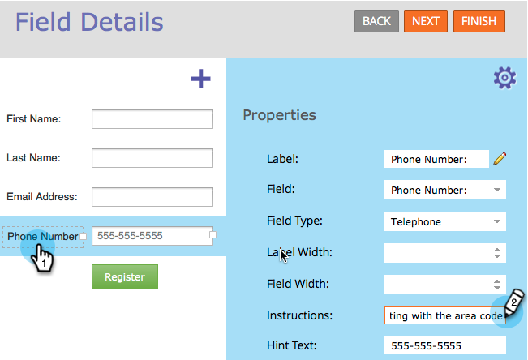

# Aggiunta di istruzioni per la descrizione comandi a un campo modulo {#add-tooltip-instructions-to-a-form-field}

[Istruzioni e ](add-hint-text-to-a-form-field.md) suggerimenti per la compilazione dei moduli. Come aggiungere le istruzioni per la descrizione comando.

>[!NOTE]
>
>**Definizione**
>
>Modulo **Suggerimenti** è un testo all&#39;interno del campo che scompare quando il visitatore inizia a digitare nel campo.
>
>Le **Istruzioni** del modulo sono piccole descrizioni che vengono visualizzate quando il visitatore passa il mouse sul campo.

1. Andate a **Marketing Activities**.

   

1. Selezionare il **modulo** e fare clic su **Modifica modulo**.

   

1. Selezionare il campo e immettere **Istruzioni**.

   

1. Fare clic su **Fine**.

   

1. Fare clic su **Approva e Chiudi**.

   

   >[!NOTE]
   >
   >**Promemoria**
   >
   >
   >Non dimenticare di [approvare la bozza della pagina di destinazione](../../../../product-docs/demand-generation/landing-pages/understanding-landing-pages/approve-unapprove-or-delete-a-landing-page.md) creata dalle modifiche apportate al modulo.

   

Impressionante lavoro! La descrizione comando viene visualizzata quando un visitatore passa il mouse sul campo.

>[!NOTE]
>
>**Tubo profondo**
>
>C&#39;è così tanto da fare con [moduli](http://docs.marketo.com/display/docs/forms).

