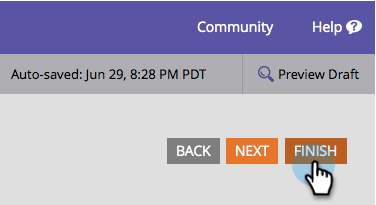
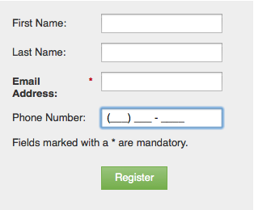

# Applicare il mascheramento di input a un campo di un modulo {#apply-input-masking-to-a-field-in-a-form}

Puoi limitare l’input del visitatore utilizzando una maschera di input. Ad esempio, è possibile che si desideri che i visitatori immettano i numeri di telefono solo in un formato specifico.

1. Passa a **[!UICONTROL Marketing Activities]**.

   

1. Selezionare il modulo e fare clic su **[!UICONTROL Edit Form]**.

   

1. Selezionare il campo e assicurarsi che **[!UICONTROL Field Type]*** sia impostato su **[!UICONTROL Text]**.

   >[!NOTE]
   >
   >Il mascheramento dell&#39;input funziona solo con **[!UICONTROL Text Field Types]**.

   

1. Fare clic sul collegamento **[!UICONTROL Mask Input]**.

   

1. Immettere la maschera di input e fare clic su **[!UICONTROL Save]**.

   

   >[!NOTE]
   >
   >Presta attenzione alle regole di mascheramento. È possibile limitare l&#39;input a numeri, lettere, entrambi e/o anche limitare il numero di caratteri immessi.

1. Fai clic su **[!UICONTROL Finish]**.

   

1. Fai clic su **[!UICONTROL Approve and Close]**.

   

   Dai un&#39;occhiata! Ora stai chiedendo al visitatore di inserire i numeri in un formato specifico.

   

   >[!NOTE]
   >
   >Il campo potrebbe non visualizzare aree predefinite, come illustrato nell’immagine precedente. Può apparire vuota finché il visitatore non inizia a immettere numeri, che poi aderiranno automaticamente al formato di input definito per il campo.

Fantastico, eh?
