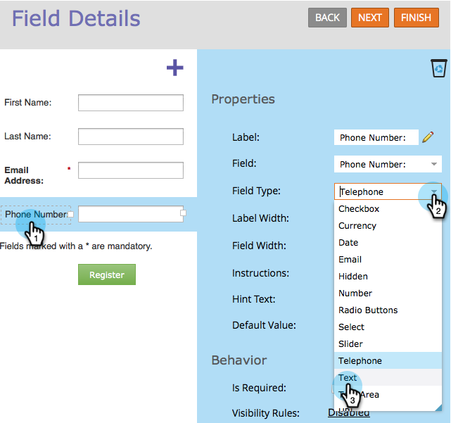

# Applicare il mascheramento di input a un campo in un modulo {#apply-input-masking-to-a-field-in-a-form}

Puoi limitare l’input del visitatore utilizzando una maschera di input. Ad esempio, potete desiderare che i visitatori inseriscano i numeri di telefono solo in un formato specifico.

1. Andate a **Marketing** **Activities**.

   

1. Selezionare il modulo e fare clic su **Modifica** **Modulo**.

   

1. Selezionare il campo e assicurarsi che il campo **Field** **Type** sia impostato su **Text**.

   >[!NOTE]
   >
   >Il mascheramento di input funziona solo con i tipi di campo di testo **Tipi di campo di testo**.

   

1. Fare clic sul collegamento **Maschera** **Input**.

   

1. Immettete la maschera di input e fate clic su **Salva**.

   

   >[!NOTE]
   >
   >Prestate attenzione alle regole di mascheramento. È possibile limitare l&#39;immissione ai numeri, alle lettere e/o addirittura limitare il numero di caratteri immessi.

1. Fare clic su **Fine**.

   

1. Fare clic su **Approva e Chiudi**.

   

   Guardate! Ora chiedi al visitatore di immettere numeri in un formato specifico.

   

   >[!NOTE]
   >
   >Il campo potrebbe non visualizzare aree predefinite come illustrato nell&#39;immagine precedente. Può apparire vuoto finché il visitatore non inizia a immettere numeri, che quindi aderiranno automaticamente al formato di input definito per il campo.

Fantastico, eh?
