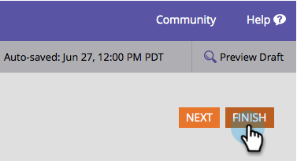

# Eliminazione di un campo in un modulo {#delete-a-field-in-a-form}

Se nel modulo non è più necessario inserire un campo, è possibile eliminarlo facilmente. Ecco come.

1. Andate a **Marketing Activities**.

   

1. Selezionare il modulo e fare clic su **Modifica modulo**.

   

1. Selezionare il campo e fare clic sull&#39;icona **delete**.

   

1. Fare clic su **Fine**.

   

1. Fare clic su **Approva e Chiudi**.

   

>[!NOTE]
>
>Non dimenticare di [approvare la bozza della pagina di destinazione](/help/marketo/product-docs/demand-generation/landing-pages/understanding-landing-pages/approve-unapprove-or-delete-a-landing-page.md) creata dalle modifiche apportate al modulo.
