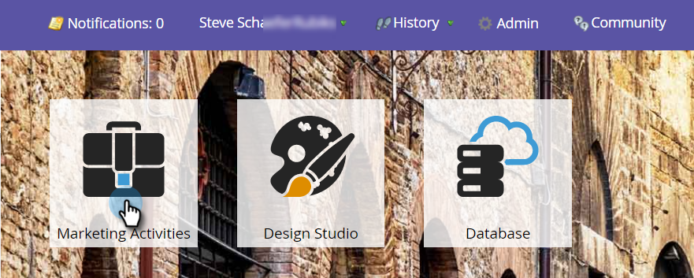

# Disattivazione della precompilazione per un campo modulo {#disable-pre-fill-for-a-form-field}

Quando un visitatore Web è noto (con cookie), per impostazione predefinita i moduli Marketo precompilano i campi con le relative informazioni. Se volete spegnere questo, ecco come farlo.

>[!NOTE]
>
>**La precompilazione** del modulo è abilitata per impostazione predefinita. Le impostazioni di precompilazione a livello di pagina di destinazione e le impostazioni di precompilazione a livello di amministratore prevalgono sulle impostazioni a livello di modulo:
>
>Modulo &lt; Pagina Di Destinazione &lt; Amministratore

1. Vai a **Marketing** **Activities**.

   

1. Selezionare il modulo e fare clic su **Modifica** **modulo**.

   

   >[!CAUTION]
   >
   >La precompilazione del modulo non funziona quando si incorpora un modulo nelle proprie pagine. Funziona solo sulle pagine di destinazione Marketo.

1. Selezionare uno dei campi e impostare **Modulo** **Pre**-**fill** su **Disattivato**.

   

   >[!TIP]
   >
   >È inoltre possibile disattivare la precompilazione del modulo a livello di pagina di destinazione o di amministratore.

1. Fare clic su **Fine**.

   

1. Fate clic su **Approva e chiudi**.

   

Bel lavoro!

>[!NOTE]
>
>**Tubo profondo**
>
>Ulteriori informazioni sui [moduli](http://docs.marketo.com/display/docs/forms)?

