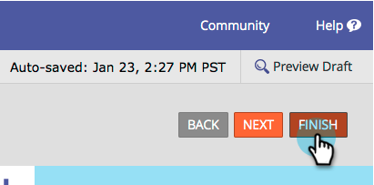

# Disabilitare la precompilazione per un campo modulo {#disable-pre-fill-for-a-form-field}

Quando un visitatore web è noto (cookie), i moduli Marketo precompilano i campi con le relative informazioni per impostazione predefinita. Se vuoi spegnerlo, ecco come farlo.

>[!NOTE]
>
>**Precompilazione modulo** è abilitato per impostazione predefinita. Le impostazioni di precompilazione a livello di pagina di destinazione e le impostazioni di precompilazione a livello di amministratore superano l’impostazione a livello di modulo:
>
>Modulo > Pagina di destinazione > Amministratore

## Come disattivare la precompilazione {#how-to-disable-pre-fill}

1. Vai a **[!UICONTROL Marketing Activities]**.

   

1. Selezionare il modulo e fare clic su **[!UICONTROL Edit Form]**.

   

   >[!CAUTION]
   >
   >La precompilazione del modulo non funziona quando si incorpora un modulo sulle proprie pagine. Funziona solo sulle pagine di destinazione di Marketo.

1. Selezionare uno dei campi e impostare **[!UICONTROL Form Pre-fill]** su **[!UICONTROL Disabled]**.

   

   >[!TIP]
   >
   >Puoi anche disattivare la precompilazione dei moduli a livello di pagina di destinazione o di amministratore.

1. Fai clic su **[!UICONTROL Finish]**.

   

1. Fai clic su **[!UICONTROL Approve and Close]**.

   

## Campi sensibili {#sensitive-fields}

Quando [contrassegni un campo come sensibile](/help/marketo/product-docs/administration/field-management/mark-a-field-as-sensitive.md), impedendo che i relativi valori vengano precompilati nei moduli, questo verrà visualizzato nell&#39;opzione Precompila.

