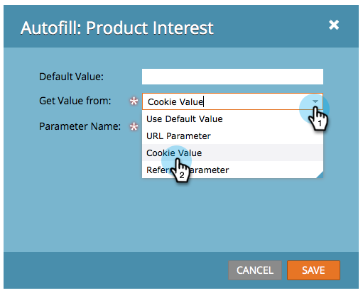

# Impostare il valore del campo modulo nascosto {#set-a-hidden-form-field-value}

In genere, i campi nascosti vengono compilati in modo dinamico. Non vengono mostrate alla persona che compila il modulo. Come impostare il valore.

>[!PREREQUISITES]
>
>[Impostazione di un campo modulo come nascosto](/help/marketo/product-docs/demand-generation/forms/form-fields/set-a-form-field-as-hidden.md)

## Selezionare il campo {#select-the-field}

1. Nel modulo, selezionare il campo nascosto e fare clic su **Modifica** per **Riempimento automatico**.

   

## Usa valore predefinito {#use-default-value}

Selezionando Usa valore predefinito è possibile codificare un valore specifico da utilizzare sempre all&#39;invio del modulo. Immettete il valore predefinito e fate clic su Salva.

## Parametro URL {#url-parameter}

Se si desidera acquisire i parametri URL (stringhe di query) dalla pagina in cui si trova l&#39;utente durante la compilazione del modulo, è possibile utilizzare **parametri URL** per compilare il campo nascosto.

>[!NOTE]
>
>I parametri sono un po&#39; tecnologici, vero? Ma una volta che li ottenete, sono potenti. Questa pagina di [Wikipedia sulle stringhe di query](https://en.wikipedia.org/wiki/Query_string) è in qualche modo utile.

1. Selezionare **Parametro URL** per **Ottieni tipo di valore**.

   

1. Immettete il **Nome parametro** e fate clic su **Salva**.

   

>[!TIP]
>
>Potete immettere un valore predefinito nel caso in cui il parametro URL non venga trovato.

## Valore cookie {#cookie-value}

Se si memorizzano i dati nei cookie, è possibile utilizzare **Cookie Value** per raccogliere i dati all&#39;invio del modulo.

1. Selezionare **Cookie Value** per **Get Value From**.

   

1. Immettete il nome del parametro cookie desiderato e fate clic su **Salva**.

   

   >[!TIP]
   >
   >Potete immettere un valore predefinito nel caso in cui il parametro/cookie non venga trovato.

## Parametro referente {#referrer-parameter}

Se si desidera acquisire i dati dalla pagina di provenienza del visitatore prima di compilare il modulo, è possibile utilizzare il parametro **Referrer**.

1. Impostare **Ottieni valore da** su **Parametro referente**.

   

1. Immettete il **Nome parametro** che desiderate acquisire dall&#39;URL del referente e fate clic su **Salva**.

   

   >[!TIP]
   >
   >È possibile immettere un **Valore predefinito** nel caso in cui il parametro del referente non sia stato trovato.

1. Fare clic su **Fine**.

   

1. Fare clic su **Approva e Chiudi**.

   
