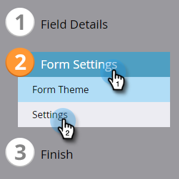

# Abilitare CAPTCHA in Marketo Forms {#enable-captcha-in-marketo-forms}

È possibile abilitare/disabilitare il CAPTCHA a livello di singolo modulo.

1. Individuare e selezionare il modulo desiderato.

   

1. Fai clic su **Modifica bozza** Se il modulo è già stato approvato, fare clic su Crea bozza.

   

1. Fai clic su **Impostazioni modulo**, quindi **Impostazioni**.

   

1. Apri il menu a discesa CAPTCHA e seleziona **Abilitato**.

   

1. Fai clic su **Fine**.

   

1. Fai clic su **Approva e chiudi**.

   

Potrebbero essere necessari alcuni minuti perché le modifiche a questo elenco si propaghino da Google.

>[!NOTE]
>
>Al modulo o ai moduli abilitati per CAPTCHA verrà aggiunto testo standardizzato, compresi i collegamenti all’Informativa sulla privacy e alle Condizioni del servizio di Google.

>[!MORELIKETHIS]
>
>[Configurazione reCAPTCHA v3](/help/marketo/product-docs/demand-generation/forms/using-captcha/setting-up-recaptcha-v3.md)
