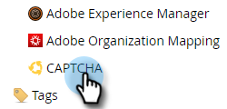

# Configurazione di reCAPTCHA v3 {#setting-up-recaptcha-v3}

ReCAPTCHA v3 è un’esperienza senza attriti che classifica gli invii di moduli in base a quanto siano sospetti senza l’utilizzo di testo, immagini o pulsanti. [Ulteriori informazioni](https://developers.google.com/search/blog/2018/10/introducing-recaptcha-v3-new-way-to){target="_blank"}.

## Recuperare l&#39;ID del centro dati e di Munchkin {#retrieve-your-data-center-and-munchkin-id}

Per il passaggio 6 della sezione Configurazione iniziale di reCAPTCHA v3 riportata di seguito, è necessario disporre dell’ID Munchkin e del centro dati dell’abbonamento di Marketo Engage. Ecco come trovarli.

1. In Marketo, fai clic su **Amministratore**.

   

1. Fai clic su **Il mio account**.

   

1. Scorri verso il basso fino a Informazioni di supporto.

   

## Configurazione iniziale di reCAPTCHA v3 {#initial-recaptcha-v3-setup}

I seguenti passaggi vengono eseguiti al di fuori di Marketo.

1. Vai a [https://www.google.com/recaptcha/about/](https://www.google.com/recaptcha/about/){target="_blank"} e fai clic sull&#39;Admin Console v3.

1. Accedi/registrati con un account Google.

1. Fai clic sul pulsante Crea (+) per creare una nuova chiave.

1. Crea un’etichetta per identificare la chiave da utilizzare per il Marketo Engage.

1. Scegliere il tipo **reCAPTCHA v3**. Il Marketo Engage non supporta reCAPTCHA v2.

1. Aggiungi ogni dominio utilizzato dalla sottoscrizione del Marketo Engage. I domini non impostati qui restituiranno errori nei moduli in cui è abilitato reCAPTCHA. Ricorda di sostituire le parole &quot;datacenter&quot; e &quot;munchkinID&quot; con i [dati nella sottoscrizione](#retrieve-your-data-center-and-munchkin-id).

   * app-datacenter.marketo.com
   * munchkinID.mktoweb.com
   * qualsiasi dominio e alias della pagina di destinazione configurato nella sottoscrizione

   >[!NOTE]
   >
   >Ad esempio, se il centro dati dell&#39;account è &quot;sjst&quot;, il dominio che si desidera inserire nell&#39;elenco Consentiti sarà `app-sjst.marketo.com`. Se l&#39;ID Munchkin è 123-ABC-789, il dominio da inserire nell&#39;elenco Consentiti sarà `123-ABC-789.mktoweb.com`.

1. Imposta un proprietario e un indirizzo e-mail aggiuntivo a cui inviare eventuali avvisi relativi al servizio.

1. Accetta i termini di servizio reCAPTCHA.

1. Fai clic su **Invia**.

   >[!NOTE]
   >
   >Mantieni a portata di mano la chiave del sito e la chiave segreta per la configurazione del Marketo Engage.

## Configurazione di CAPTCHA nel Marketo Engage {#setting-up-captcha-in-marketo-engage}

>[!IMPORTANT]
>
>Dopo aver eseguito questi passaggi e aver [abilitato CAPTCHA nel primo Marketo form](/help/marketo/product-docs/demand-generation/forms/using-captcha/enable-captcha-in-marketo-forms.md){target="_blank"}, assicurarsi di verificare immediatamente il modulo in quanto qualsiasi configurazione errata nella configurazione di reCAPTCHA potrebbe interrompere il modulo.

1. In Marketo, fai clic su **Amministratore**.

   

1. Selezionare **CAPTCHA** nella struttura.

   

1. Fare clic su **Modifica** per le impostazioni CAPTCHA.

   

1. Fai clic sul menu a discesa CAPTCHA e scegli reCAPTCHA v3.

   

1. Inserisci la chiave segreta e la chiave del sito. Al termine, fai clic su **Salva**.

   

>[!MORELIKETHIS]
>
>[Abilitare CAPTCHA in Marketo Forms](/help/marketo/product-docs/demand-generation/forms/using-captcha/enable-captcha-in-marketo-forms.md)
