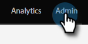

# Configurazione reCAPTCHA v3 {#setting-up-recaptcha-v3}

ReCAPTCHA v3 è un&#39;esperienza senza attriti che classifica gli invii dei moduli in base a quanto siano sospetti senza utilizzare il testo, l&#39;immagine o le sfide del pulsante. [Ulteriori informazioni](https://developers.google.com/search/blog/2018/10/introducing-recaptcha-v3-new-way-to){target=&quot;_blank&quot;}.

## Recupera il tuo Data Center e l&#39;ID Munchkin {#retrieve-your-data-center-and-munchkin-id}

Per il passaggio 6 nella sezione Initial reCAPTCHA v3 setup (Configurazione iniziale reCAPTCHA v3) qui sotto, avrai bisogno del Data Center e dell’ID Munchkin del tuo abbonamento al Marketo Engage. Ecco come trovarle.

1. In Marketo, fai clic su **Amministratore**.

   

1. Fai clic su **Il mio account**.

   

1. Scorri verso il basso fino a Informazioni di supporto.

   

## Configurazione iniziale di reCAPTCHA v3 {#initial-recaptcha-v3-setup}

I seguenti passaggi vengono eseguiti all’esterno di Marketo.

1. Vai a [https://www.google.com/recaptcha/about/](https://www.google.com/recaptcha/about/){target=&quot;_blank&quot;} e fai clic sull&#39;Admin Console v3.

1. Accedi/registrati con un account Google.

1. Fai clic sul pulsante Crea (+) per creare una nuova chiave.

1. Crea un’etichetta per identificare la chiave da utilizzare come Marketo Engage.

1. Scegli tipo **reCAPTCHA v3**. Al momento il Marketo Engage non supporta reCAPTCHA v2.

1. Aggiungi ogni dominio utilizzato dalla sottoscrizione del Marketo Engage. I domini non impostati qui restituiranno errori nei moduli in cui è abilitato reCAPTCHA. Ricorda di sostituire le parole &#39;datacenter&#39; e &#39;munchkinID&#39; con [dati dell’abbonamento](#retrieve-your-data-center-and-munchkin-id).

   * app-datacenter.marketo.com
   * munchkinID.mktoweb.com
   * qualsiasi dominio e alias della pagina di destinazione configurato nella sottoscrizione

   >[!NOTE]
   >
   >Ad esempio, se il Data Center del tuo account è &quot;sjst&quot;, il dominio inserire nell&#39;elenco Consentiti sarebbe `app-sjst.marketo.com`. Se l&#39;ID Munchkin è 123-ABC-789, il dominio inserire nell&#39;elenco Consentiti sarà `123-ABC-789.mktoweb.com`.

1. Imposta un proprietario e un indirizzo e-mail aggiuntivo che deve ricevere eventuali avvisi sul servizio.

1. Accettare i termini di servizio reCAPTCHA.

1. Fai clic su **Invia**.

   >[!NOTE]
   >
   >Mantieni la chiave del sito e la chiave segreta a portata di mano per la configurazione del Marketo Engage.

## Impostazione del CAPTCHA nel Marketo Engage {#setting-up-captcha-in-marketo-engage}

>[!IMPORTANT]
>
>Dopo aver seguito questi passaggi e [abilitare CAPTCHA nel primo modulo Marketo](/help/marketo/product-docs/demand-generation/forms/using-captcha/enable-captcha-in-marketo-forms.md){target=&quot;_blank&quot;}, assicurati di testare immediatamente il modulo in quanto qualsiasi tipo di configurazione errata nell’impostazione reCAPTCHA può interrompere il modulo.

1. In Marketo, fai clic su **Amministratore**.

   

1. Seleziona **CAPTCHA** nell&#39;albero.

   

1. Fai clic su **Modifica** sulle impostazioni CAPTCHA.

   

1. Fai clic sull’elenco a discesa CAPTCHA e scegli reCAPTCHA v3.

   

1. Inserire la chiave segreta e la chiave del sito. Fai clic su **Salva** al termine.

   

>[!MORELIKETHIS]
>
>[Abilitare CAPTCHA in Marketo Forms](/help/marketo/product-docs/demand-generation/forms/using-captcha/enable-captcha-in-marketo-forms.md)
