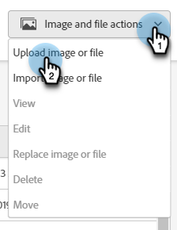
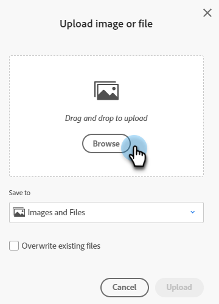

# Aggiungere immagini e file a Marketo {#add-images-and-files-to-marketo}

Scopri come aggiungere nuove immagini o file all’istanza Marketo Engage.

1. Passare a **[!UICONTROL Design Studio]**.

   

1. Seleziona **[!UICONTROL Images and Files]**

   

1. Fai clic sul menu a discesa **[!UICONTROL Image and file actions]** e seleziona **[!UICONTROL Upload image or file]**.

   

1. Trascina e rilascia l’immagine o il file desiderato oppure individua il computer.

   

   >[!NOTE]
   >
   >La dimensione massima per file è 100 MB.

1. Dopo aver selezionato la risorsa, fai clic su **Carica**.

   

   >[!NOTE]
   >
   >Mentre Marketo accetta tutti i tipi di file per il caricamento, solo i tipi di immagine principali (JPG, PNG, GIF, ecc.) funzionerà nell’editor e-mail.

   >[!MORELIKETHIS]
   >
   >[Organizza immagini e file utilizzando le cartelle](/help/marketo/product-docs/demand-generation/images-and-files/organize-your-images-and-files-using-folders.md){target="_blank"}
