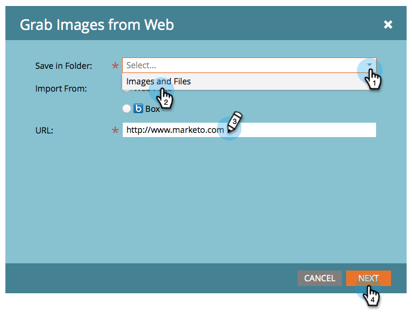
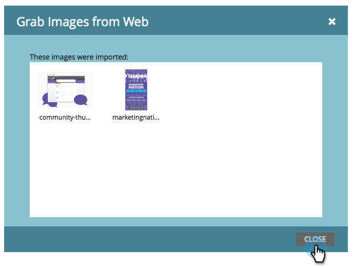
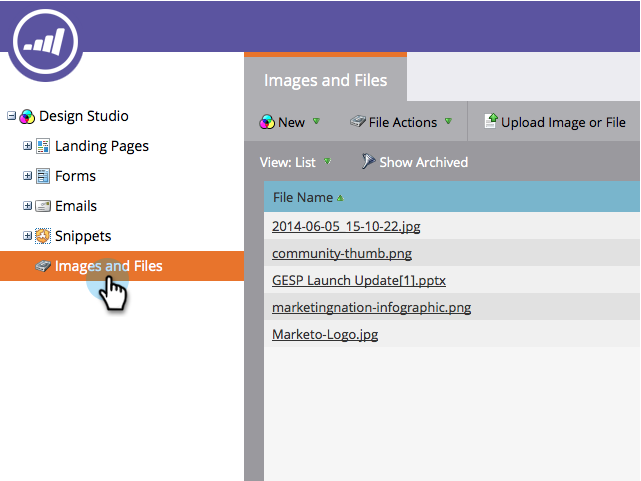

# Acquisire immagini da una pagina web {#grab-the-images-from-a-web-page}

Per aggiungere immagini da una pagina web, copia l’indirizzo web (URL) della pagina contenente le immagini desiderate, quindi segui la procedura riportata di seguito.

1. Passa a **[!UICONTROL Design Studio]**.

   

1. Fare clic su **[!UICONTROL New]** e **[!UICONTROL Grab Images from Web]**.

   

1. Selezionare la cartella **[!UICONTROL Images and Files]**, incollare l&#39;indirizzo Web (URL) nella casella di testo URL e fare clic su **[!UICONTROL Next]**.

   

   >[!NOTE]
   >
   >Questa funzione non funziona con URL che puntano direttamente a un’immagine. Utilizza l’URL della pagina web che contiene le immagini.

1. Selezionare le immagini da aggiungere e fare clic su **[!UICONTROL Import]**.

   

1. Le immagini sono ora importate e disponibili per l’utilizzo nelle e-mail e nelle pagine di destinazione.

   

1. Puoi visualizzare tutte le immagini disponibili in **[!UICONTROL Images and Files]**.

   

>[!MORELIKETHIS]
>
>* [Aggiungi immagini e file a Marketo](/help/marketo/product-docs/demand-generation/images-and-files/add-images-and-files-to-marketo.md)
>* [Organizza immagini e file utilizzando le cartelle](/help/marketo/product-docs/demand-generation/images-and-files/organize-your-images-and-files-using-folders.md)
>* [Trovare l&#39;URL di un&#39;immagine o di un file caricato](/help/marketo/product-docs/demand-generation/images-and-files/find-the-url-of-an-uploaded-image-or-file.md)
>* [Carica immagini e file dalla casella](/help/marketo/product-docs/demand-generation/images-and-files/upload-images-and-files-from-box.md)
