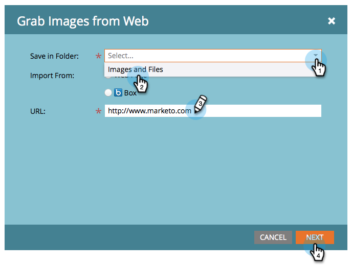

# Acquisire le immagini da una pagina web {#grab-the-images-from-a-web-page}

Per aggiungere immagini da una pagina web, copia l’indirizzo web (URL) della pagina che contiene le immagini desiderate, quindi segui questi semplici passaggi.

1. Vai a **Design Studio**.

   

1. Fai clic su **Nuovo** e **Acquisisci immagini dal web**.

   

1. Seleziona la **Immagini e file** , incolla l’indirizzo Web (URL) nella casella di testo URL e fai clic su **Successivo**.

   

   >[!NOTE]
   >
   >Questa funzione non funziona con gli URL che puntano direttamente a un’immagine. Utilizza l’URL della pagina web che contiene le immagini.

1. Seleziona le immagini da aggiungere e fai clic su **Importa**.

   

1. Le immagini sono ora importate e disponibili per l’utilizzo in e-mail e pagine di destinazione.

   

1. È possibile visualizzare tutte le immagini disponibili in **Immagini e file**.

   

Ottimo lavoro, maestro dell&#39;immagine!

>[!MORELIKETHIS]
>
>* [Aggiungere immagini e file a Marketo](/help/marketo/product-docs/demand-generation/images-and-files/add-images-and-files-to-marketo.md)
>* [Organizzare immagini e file utilizzando le cartelle](/help/marketo/product-docs/demand-generation/images-and-files/organize-your-images-and-files-using-folders.md)
>* [Trova l&#39;URL di un&#39;immagine o di un file caricato](/help/marketo/product-docs/demand-generation/images-and-files/find-the-url-of-an-uploaded-image-or-file.md)
>* [Carica immagini e file dalla casella](/help/marketo/product-docs/demand-generation/images-and-files/upload-images-and-files-from-box.md)

