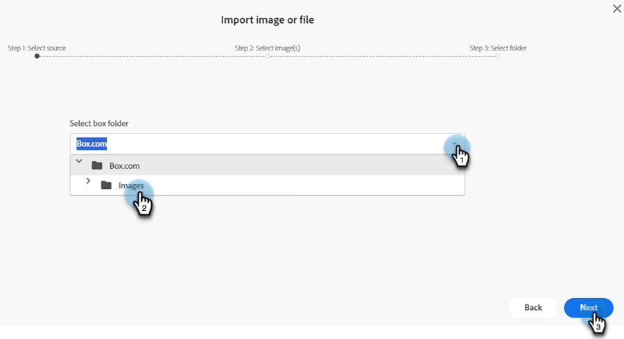

# Nuovo documento Aggiungi immagini {#new-add-images-doc}

Sono disponibili più opzioni per aggiungere nuovi file/immagini all&#39;archivio Immagini e file.

## Carica immagine o file {#upload-image-or-file}

1. Vai a **Design Studio**.

   

1. Seleziona **[!UICONTROL Immagini e file]**

   

1. Fai clic su **[!UICONTROL Azioni immagine e file]** a discesa e selezionare **[!UICONTROL Carica immagine o file]**.

   

1. Trascina e rilascia l’immagine o il file desiderato oppure individua il computer.

   

1. Dopo aver selezionato la risorsa, fai clic su **Carica**.

   

## Importa immagine o file {#import-image-or-file}

Sono disponibili tre opzioni per l&#39;importazione di un&#39;immagine. Andiamo su ognuno di loro.

### Importa dal Web {#import-from-the-web}

Testo

1. Segui i passaggi 1 e 2 [dall&#39;alto](#upload-image-or-file).

1. Fai clic su **[!UICONTROL Azioni immagine e file]** a discesa e selezionare **[!UICONTROL Importa immagine o file]**.

   

1. Seleziona la **[!UICONTROL Web]** e fai clic su **[!UICONTROL Successivo]**.

   

1. Digita o incolla l’URL dell’immagine desiderata e fai clic su **Successivo**.

PICC

1. Fare clic su VUOTO.

PICC

### Importa da Box {#import-from-box}

Testo

1. Segui i passaggi 1 e 2 [dall&#39;alto](#upload-image-or-file).

1. Fai clic su **[!UICONTROL Azioni immagine e file]** a discesa e selezionare **[!UICONTROL Importa immagine o file]**.

   

1. Seleziona la **[!UICONTROL Casella]** e fai clic su **[!UICONTROL Successivo]**.

   

   >[!NOTE]
   >
   >Se non lo hai già fatto, ti verrà chiesto di accedere al tuo account Box per concedere l’accesso.

1. Seleziona la cartella Box desiderata e fai clic su **[!UICONTROL Successivo]**.

   

1. Seleziona le immagini desiderate e fai clic su **[!UICONTROL Successivo]**.

   

1. Selezionare la cartella di Marketo Engage in cui salvare l&#39;immagine. In questo esempio lo lasceremo come Immagini e file (impostazione predefinita). Clic **Importa**.

   

### Importa da Adobe Experience Manager {#import-from-adobe-experience-manager}

Testo

1. Segui i passaggi 1 e 2 [dall&#39;alto](#upload-image-or-file).

1. Fai clic su **[!UICONTROL Azioni immagine e file]** a discesa e selezionare **[!UICONTROL Importa immagine o file]**.

   

1. Seleziona la **[!UICONTROL Adobe Experience Manager]** e fai clic su **[!UICONTROL Successivo]**.

   

   >[!NOTE]
   >
   >Se non lo hai già fatto, ti verrà chiesto di accedere al tuo account AEM.

1. Testo

PICC

1. Testo

PICC

1. Testo
