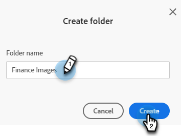
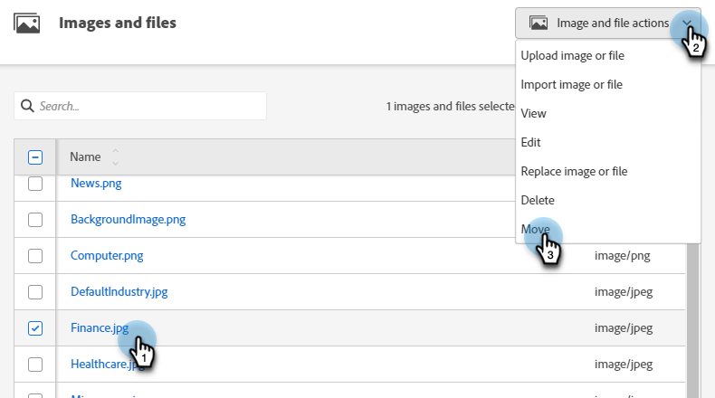

# Organizzazione di immagini e file mediante le cartelle {#organize-your-images-and-files-using-folders}

La creazione di cartelle consente di spostare immagini e file, visualizzare solo il set di immagini desiderato e caricarlo direttamente in una cartella specifica.

1. Passare a **[!UICONTROL Design Studio]**.

   

1. Fare clic con il pulsante destro del mouse su **[!UICONTROL Images and Files]** e selezionare **[!UICONTROL New folder]**.

   

1. Assegna un nome alla cartella e fai clic su **[!UICONTROL Create]**.

   

1. Torna a **[!UICONTROL Images and Files]** e seleziona la risorsa da spostare. Fai clic sul menu a discesa **[!UICONTROL Image and file actions]** e seleziona **[!UICONTROL Move]**.

   

1. Seleziona la cartella desiderata.

   

1. Fai clic su **Move**.

   

>[!MORELIKETHIS]
>
>[Cerca immagini e file caricati](/help/marketo/product-docs/demand-generation/images-and-files/search-uploaded-images-and-files.md){target="_blank"}
