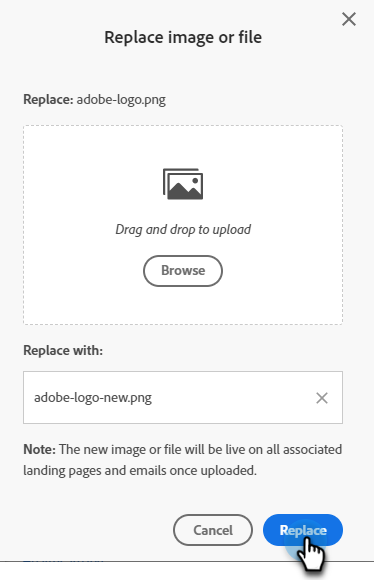

# Sostituire un’immagine o un file caricato {#replace-an-uploaded-image-or-file}

1. Passare a **[!UICONTROL Design Studio]**.

   

1. Fai clic su **[!UICONTROL Images and Files]**.

   

1. Seleziona la risorsa da sostituire. Fai clic sul menu a discesa **[!UICONTROL Image and file actions]** e seleziona **[!UICONTROL Replace image or file]**.

   

1. Trascinare o sfogliare il computer per la sostituzione dell&#39;immagine o del file.

   

   >[!NOTE]
   >
   >Il tipo di file sostitutivo deve essere lo stesso dell’originale (ad esempio, .jpg)

1. Dopo aver selezionato l&#39;immagine o il file sostitutivo, fare clic su **[!UICONTROL Replace]**.

   

   >[!NOTE]
   >
   >Il nome del file sostitutivo verrà modificato in modo da corrispondere al nome del file precedente.

>[!MORELIKETHIS]
>
>* [Cerca immagini e file caricati](/help/marketo/product-docs/demand-generation/images-and-files/search-uploaded-images-and-files.md){target="_blank"}
>* [Trovare l&#39;URL di un&#39;immagine o di un file caricato](/help/marketo/product-docs/demand-generation/images-and-files/find-the-url-of-an-uploaded-image-or-file.md){target="_blank"}
