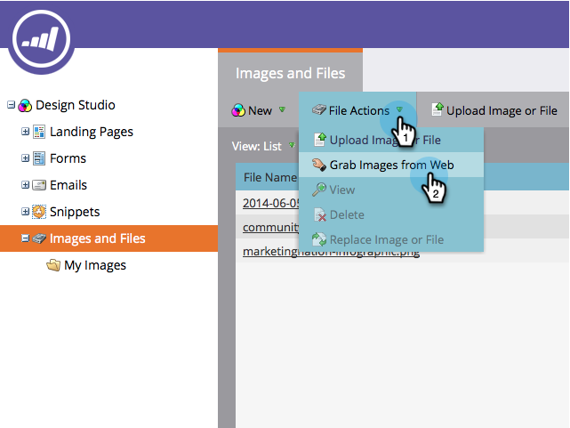
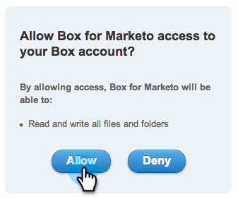
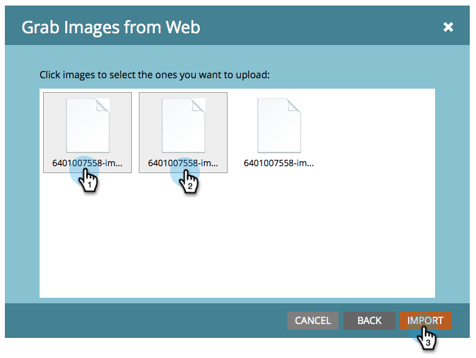

# Caricare immagini e file da Box {#upload-images-and-files-from-box}

Puoi caricare file da Box per utilizzarli nelle pagine di destinazione e nelle e-mail.

1. Passa a **[!UICONTROL Design Studio]**.

   

1. Passa a **[!UICONTROL Images and Files]**. Fare clic su **[!UICONTROL File Actions]** e selezionare **[!UICONTROL Grab Images from Web]**.

   

1. Fai clic su **[!UICONTROL Box]**.

   

1. Immetti l&#39;accesso a [!DNL Box].

   

1. Consenti a Marketo di accedere al tuo account [!DNL Box].

   

1. Scegliere la posizione in cui salvare i file. Selezionare quindi la cartella **[!DNL Box]** da cui si desidera caricare. Fai clic su **[!UICONTROL Next]**.

   

1. Seleziona i file da caricare. Fai clic su **[!UICONTROL Import]**.

   

I file sono ora pronti per essere utilizzati nelle pagine di destinazione e nelle e-mail.
