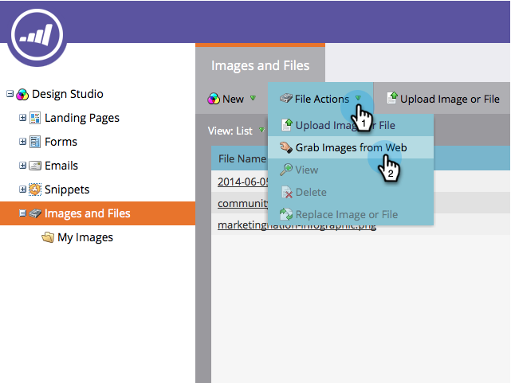

# Caricare immagini e file dalla casella {#upload-images-and-files-from-box}

Potete caricare i file da Box per utilizzarli nelle pagine di destinazione e nelle e-mail.

1. Passare a **Design** **Studio**.

   

1. Vai a** Immagini e file**. Fare clic su **Azioni file** e selezionare **Acquisisci immagini da Web**.

   

1. Fare clic su **Box**.

   

1. Inserire il login Box.

   

1. Consenti a Marketo di accedere al tuo account Box.

   

1. Scegliete dove salvare i file. Selezionate quindi la cartella **Box** da cui desiderate caricare i file. Fare clic su **Next**.

   

1. Selezionate i file da caricare. Fare clic su **Importa**.

   

I file sono pronti per essere utilizzati nelle pagine di destinazione e nelle e-mail!