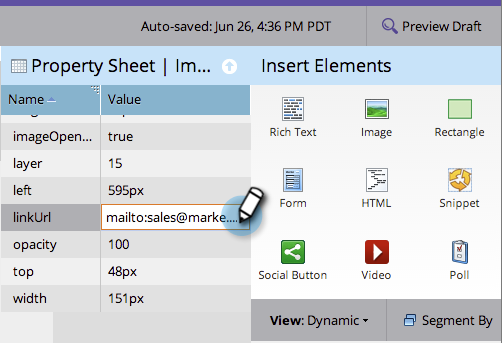

# Aggiungere un collegamento all’immagine di una pagina di destinazione in formato libero {#add-a-link-to-a-free-form-landing-page-image}

>[!PREREQUISITES]
>
>[Aggiungere un&#39;immagine a una pagina di destinazione in formato libero](/help/marketo/product-docs/demand-generation/landing-pages/free-form-landing-pages/add-an-image-to-a-free-form-landing-page.md)

>[!NOTE]
>
>Questo vale solo per le pagine di destinazione in formato libero.

1. Seleziona l&#39;immagine aggiunta alla pagina di destinazione ed espandi **[!UICONTROL Property Sheet]**.

   

1. Digitare il collegamento mailto in **[!UICONTROL linkUrl]**.

   

   Nella pagina di destinazione di Marketo è ora disponibile un’immagine come collegamento e-mail.

   
