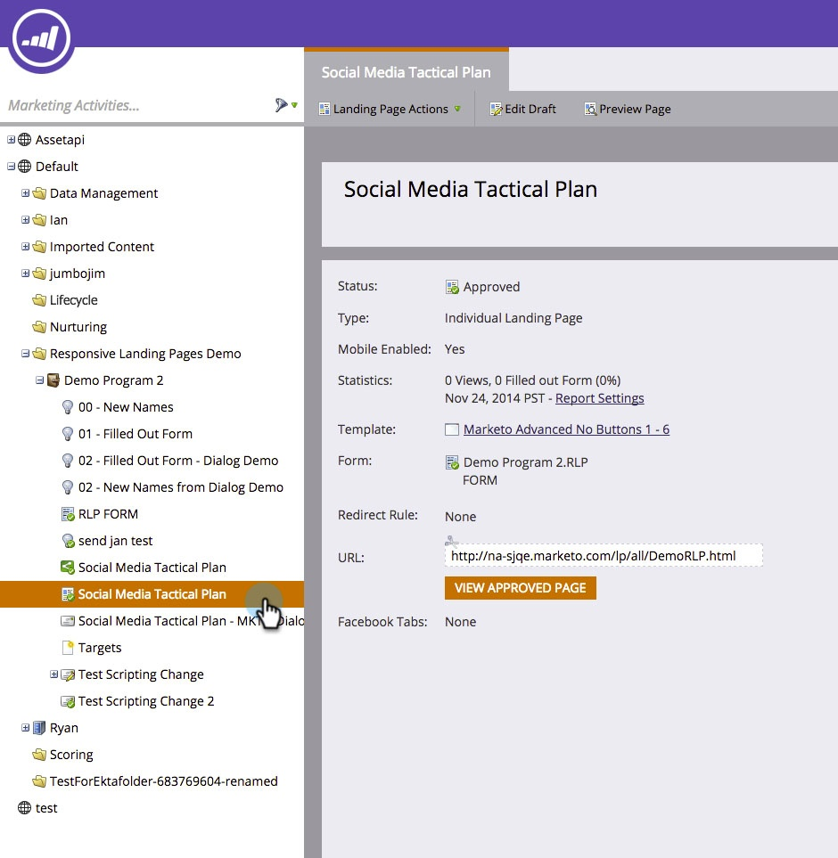
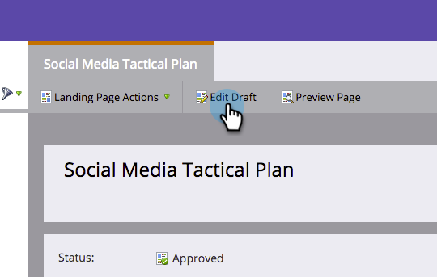
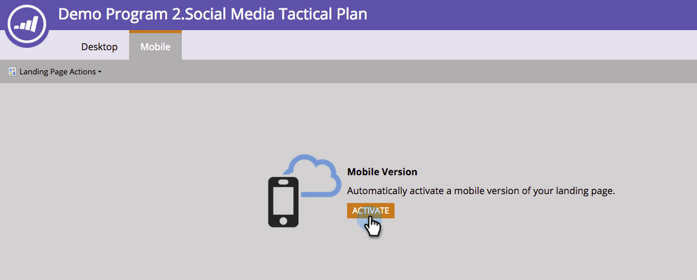
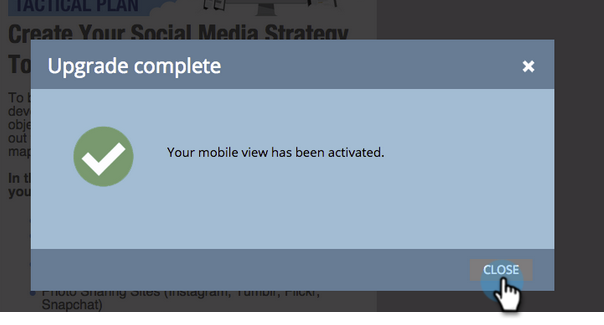
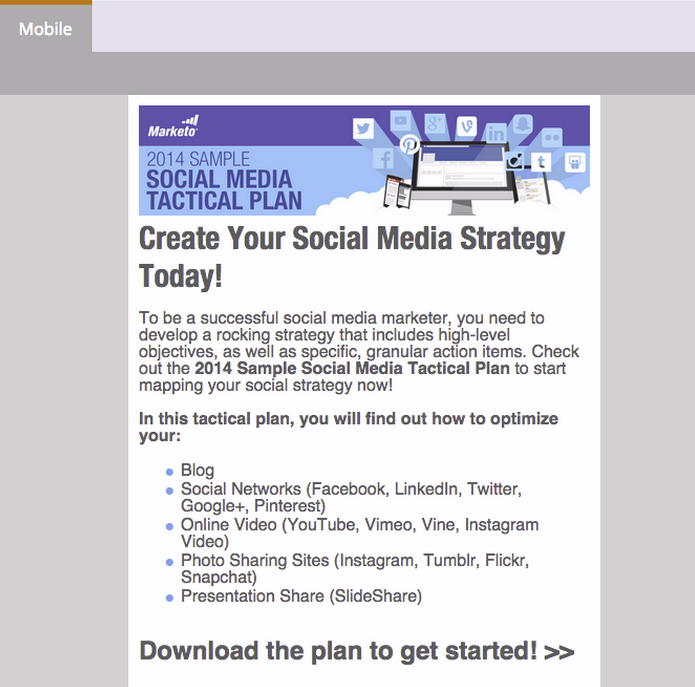

# Aggiungere una visualizzazione per dispositivi mobili alla pagina di destinazione in formato libero {#add-a-mobile-view-for-your-free-form-landing-page}

Puoi ottimizzare le pagine di destinazione in formato libero per visualizzarle correttamente sugli smartphone.

>[!NOTE]
>
>La visualizzazione mobile funziona su schermi larghi 480 px (o meno). In altre parole, gli smartphone. Ecco altre [informazioni sulle risoluzioni dei dispositivi](https://www.mydevice.io/).

1. Passa a **[!UICONTROL Marketing Activities]**.

   

1. Seleziona una pagina di destinazione in formato libero.

   

1. Fai clic su **[!UICONTROL Edit Draft]**.

   

1. Fai clic sulla scheda **[!UICONTROL Mobile]**.

   

1. Fai clic su **[!UICONTROL Activate]**.

   

   >[!CAUTION]
   >
   >Potrebbe essere necessario aggiornare il modello di modulo libero. Se ricevi questo messaggio, leggi rapidamente come [rendere compatibile con dispositivi mobili un modello di pagina di destinazione in formato libero esistente](/help/marketo/product-docs/demand-generation/landing-pages/landing-page-templates/make-an-existing-free-form-landing-page-template-mobile-compatible.md).

1. Ora hai attivato la versione mobile della pagina di destinazione. Fai clic su **[!UICONTROL Close]**.

   

   Ora puoi [personalizzare la tua visualizzazione per dispositivi mobili](/help/marketo/product-docs/demand-generation/landing-pages/free-form-landing-pages/customize-mobile-view-for-your-free-form-landing-page.md).

   
