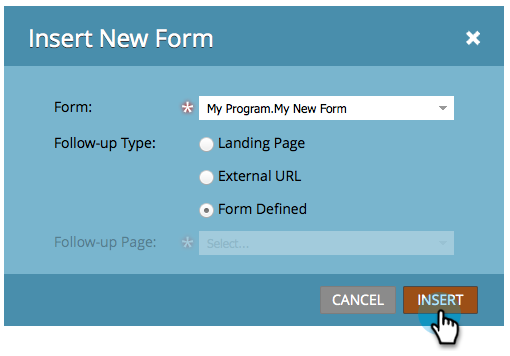

# Aggiungere un nuovo modulo a una pagina di destinazione a forma libera {#add-a-new-form-to-a-free-form-landing-page}

Modulo, incontra la pagina di destinazione. Pagina di destinazione, modulo di riunione.

>[!PREREQUISITES]
>
>* [Creazione di un modulo](../../../../product-docs/demand-generation/forms/creating-a-form/create-a-form.md)
>* [Creare una pagina di destinazione a forma libera](create-a-free-form-landing-page.md)

>

1. Vai a **Marketing** **Activities**.

   

1. Individuate la pagina di destinazione e fate clic su **Modifica** **bozza**.

   

1. Trascinare l’elemento **Modulo** sulla pagina.

   

1. Individuare e selezionare il modulo da aggiungere.

   

1. Quando si sceglie la pagina di follow-up sono disponibili tre opzioni:

   * **Pagina** di destinazione - per selezionare una pagina di destinazione Marketo
   * **URL esterno***** - per scegliere l&#39;URL desiderato

   * **Modulo**** Defined** - per utilizzare le impostazioni definite a livello di modulo
   >[!NOTE]
   >
   >**Definizione**
   >
   >
   >La pagina che segue è la pagina che gli utenti vedranno dopo aver inviato il modulo.

1. Fate clic su **Inserisci**.

   

   Ben fatto!

Chiudi l’editor della pagina di destinazione e [approva la bozza](../../../../product-docs/demand-generation/landing-pages/understanding-landing-pages/approve-unapprove-or-delete-a-landing-page.md)della pagina di destinazione.
