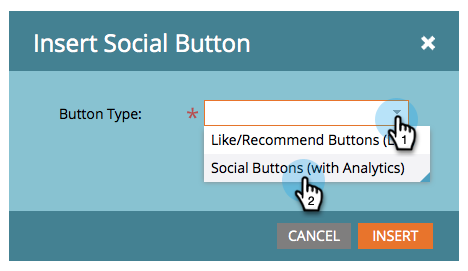

# Aggiungere un pulsante Social a una pagina di destinazione in formato libero {#add-a-social-button-to-a-free-form-landing-page}

Un pulsante social incoraggia le persone a condividere i tuoi contenuti con i loro amici. Puoi rilasciarlo nelle pagine di destinazione in formato libero, su Facebook e sul tuo sito web.

>[!AVAILABILITY]
>
>Non tutti gli utenti di Marketo Engage hanno acquistato questa funzionalità. Per informazioni, contatta il team dell’account di Adobe (il tuo Account Manager).

1. Passare alla pagina di destinazione in formato libero e fare clic su **[!UICONTROL Edit Draft]**.

   

1. Trascina su **[!UICONTROL Social Button]** dagli elementi a destra.

   

1. Seleziona **[!UICONTROL Social Buttons (with Analytics)]**.

   

   Una volta che la pagina di destinazione è attiva, puoi visualizzare l’attività generata dal pulsante per social network (con Analytics) sulla dashboard di social network.

   Se invece aggiungi [!UICONTROL Like/Recommend Button (Lite)], vedi il numero di condivisioni nel [rapporto sulle prestazioni della pagina di destinazione](/help/marketo/product-docs/demand-generation/landing-pages/understanding-landing-pages/landing-page-performance-report.md).

1. Selezionare **[!UICONTROL Create New]** dal menu a discesa.

   >[!NOTE]
   >
   >È inoltre possibile creare un pulsante social all&#39;interno di un programma selezionando **[!UICONTROL New]** > **[!UICONTROL New Local Asset]**.

1. Assegna un nome al pulsante social, seleziona **[!UICONTROL None]** da **[!UICONTROL Clone From]** e fai clic su **[!UICONTROL Insert]**.

   

   >[!TIP]
   >
   >Per risparmiare tempo, puoi utilizzare l&#39;opzione **[!UICONTROL Clone From]** per copiare tutte le impostazioni da un pulsante social esistente.

1. Pubblica la pagina di destinazione [su Facebook](/help/marketo/product-docs/demand-generation/facebook/publish-landing-pages-to-facebook.md) e inserisci il pulsante per social network nel tuo sito Web.

Hai aggiunto un pulsante Social alla pagina di destinazione. Approva la pagina di destinazione quando sei pronto.
