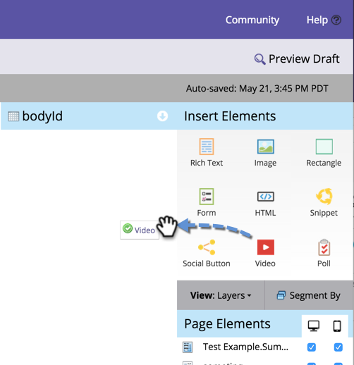

# Aggiungere un video a una pagina di destinazione in formato libero {#add-a-video-to-a-free-form-landing-page}

Inserisci video con opzioni di condivisione social nelle pagine di destinazione.

>[!AVAILABILITY]
>
>Questa funzionalità non è stata acquistata da tutti i clienti. Per ulteriori informazioni, contatta il tuo rappresentante commerciale.

1. Passa alla pagina di destinazione in formato libero e fai clic su **Modifica bozza**.

   

1. Trascina **Video** dagli elementi a destra.

   

1. Seleziona **Crea nuovo** dal menu a discesa.

   

   >[!NOTE]
   >
   >Il **Crea nuovo** Questa funzione viene visualizzata solo in Marketing Activities (Attività di marketing) e non è disponibile in Design Studio. In Design Studio sono disponibili solo i video già creati. Tuttavia, puoi creare una condivisione video _all’interno di un programma_ selezionando **Nuovo** > **Nuova risorsa locale**. Puoi selezionarlo dall’elenco a discesa, come illustrato qui.

1. Inserisci l’URL del video YouTube, quindi assegna un nome al video. Sotto il menu a discesa Clona da, seleziona **Nessuno**, quindi fai clic su **Inserisci**.

   

>[!TIP]
>
>Per risparmiare tempo, puoi utilizzare **Clona da** per copiare tutte le impostazioni da una condivisione video esistente.

Congratulazioni! Hai aggiunto una condivisione video alla pagina di destinazione in formato libero. Approva la pagina di destinazione e la condivisione video è live. È inoltre possibile [pubblicare la pagina di destinazione in Facebook](/help/marketo/product-docs/demand-generation/facebook/publish-landing-pages-to-facebook.md) o [inserisci la condivisione video sul sito web](/help/marketo/product-docs/demand-generation/social/social-functions/deploy-social-on-your-website.md).

>[!MORELIKETHIS]
>
>Al termine, è possibile modificare le impostazioni della condivisione video, se necessario. Inizia con  [personalizzazione del flusso di condivisione](/help/marketo/product-docs/demand-generation/social/configuring-social-actions/customize-video-share-flow.md) (quando e dove viene visualizzato il prompt di condivisione).
