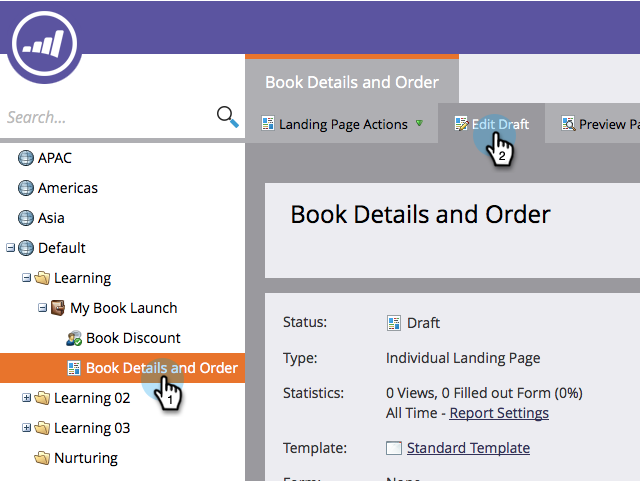

# Aggiungere un video a una pagina di destinazione in formato libero {#add-a-video-to-a-free-form-landing-page}

Inserisci video con opzioni di condivisione social nelle pagine di destinazione.

>[!AVAILABILITY]
>
>Non tutti gli utenti di Marketo Engage hanno acquistato questa funzionalità. Per informazioni, contatta il team dell’account di Adobe (il tuo Account Manager).

1. Passare alla pagina di destinazione in formato libero e fare clic su **[!UICONTROL Edit Draft]**.

   

1. Trascina su **[!UICONTROL Video]** dagli elementi a destra.

   

1. Selezionare **[!UICONTROL Create New]** dal menu a discesa.

   

   >[!NOTE]
   >
   >La funzionalità **[!UICONTROL Create New]** è disponibile solo in [!UICONTROL Marketing Activities] e non in [!UICONTROL Design Studio]. In Design Studio sono disponibili solo i video già creati. È tuttavia possibile creare una condivisione video _all&#39;interno di un programma_ selezionando **[!UICONTROL New]** > **[!UICONTROL New Local Asset]**. Puoi selezionarlo dall’elenco a discesa, come illustrato qui.

1. Inserisci l’URL del video YouTube, quindi assegna un nome al video. Nel menu a discesa **[!UICONTROL Clone From]**, seleziona **[!UICONTROL None]**, quindi fai clic su **[!UICONTROL Insert]**.

   

>[!TIP]
>
>Per risparmiare tempo, è possibile utilizzare l&#39;opzione **[!UICONTROL Clone From]** per copiare tutte le impostazioni da una condivisione video esistente.

Hai aggiunto una condivisione video alla pagina di destinazione in formato libero. Approva la pagina di destinazione e la condivisione video è live. Puoi anche [pubblicare la pagina di destinazione su Facebook](/help/marketo/product-docs/demand-generation/facebook/publish-landing-pages-to-facebook.md) o inserire la condivisione video nel tuo sito Web.
