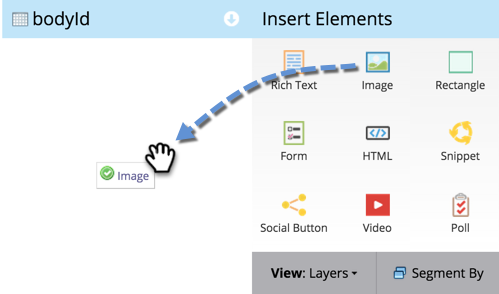
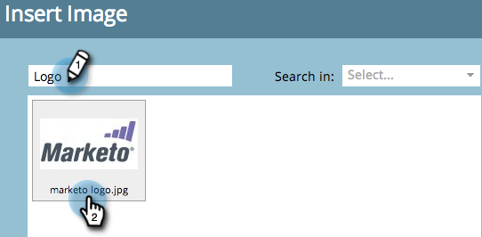
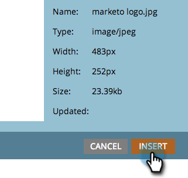
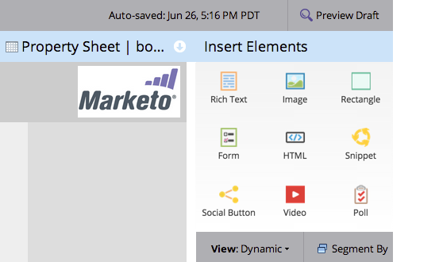

# Aggiungere un’immagine a una pagina di destinazione in formato libero {#add-an-image-to-a-free-form-landing-page}

>[!PREREQUISITES]
>
>[Aggiungi immagini e file a Marketo](/help/marketo/product-docs/demand-generation/images-and-files/add-images-and-files-to-marketo.md)

1. Selezionare la pagina di destinazione in formato libero e fare clic su **[!UICONTROL Edit Draft]**.

   

1. Nell&#39;editor, trascinare sull&#39;elemento **[!UICONTROL Image]**.

   

1. Individuare e selezionare l&#39;immagine desiderata.

   

1. Fai clic su **[!UICONTROL Insert]**.

   

   Hai aggiunto un’immagine alla pagina di destinazione in formato libero.

   
