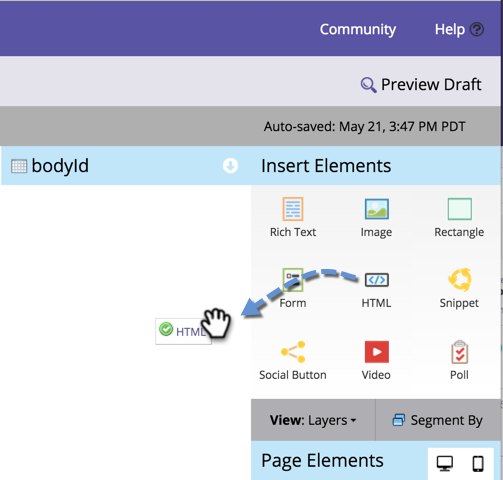

# Aggiunta di HTML personalizzati a una pagina di destinazione in formato libero {#adding-custom-html-to-a-free-form-landing-page}

Puoi aggiungere script personalizzati, CSS o altri HTML alle pagine di destinazione.

>[!NOTE]
>
>Il supporto Marketo non è configurato per fornire assistenza nella risoluzione dei problemi relativi a HTML personalizzati. Per assistenza su HTML, consulta uno sviluppatore web.

1. Seleziona la pagina di destinazione e fai clic su **Modifica bozza**.

   

1. Nell’editor delle pagine di destinazione, trascina **HTML** elemento.

   

1. Immetti il codice HTML personalizzato e fai clic su **Salva**.

   

Bello! Inserisci gli script o i CSS desiderati.

>[!TIP]
>
>Quando possibile, testa l’origine HTML personalizzata in un ambiente locale prima di distribuirla in una pagina di destinazione.

>[!CAUTION]
>
>Se HTML personalizzato non esegue il rendering (ad esempio una funzione JavaScript invisibile o CSS), inserisci l’elemento in una posizione memorizzabile come in alto a sinistra. Il profilo dell’elemento è visibile solo quando fai clic nella relativa area.
