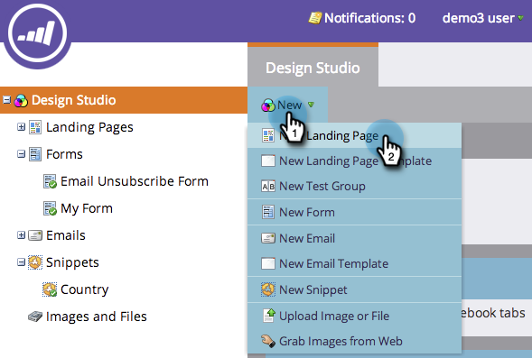
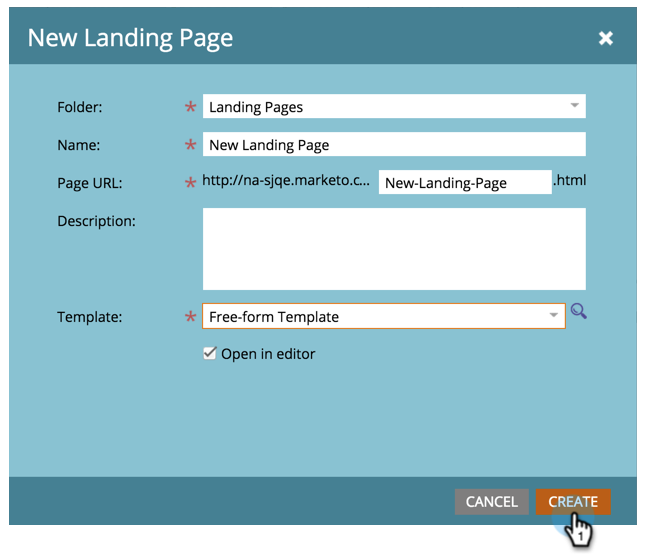

# Creare una pagina di destinazione in formato libero {#create-a-free-form-landing-page}

Le pagine di destinazione in formato libero possono essere create come risorse locali di un programma o in Design Studio per essere utilizzate a livello globale.

>[!NOTE]
>
>Le modalità della pagina di destinazione sono definite dal relativo modello. [Ulteriori informazioni](/help/marketo/product-docs/demand-generation/landing-pages/understanding-landing-pages/understanding-free-form-vs-guided-landing-pages.md) informazioni sui modelli di pagina di destinazione in formato libero e guidato.

## Creare una pagina di destinazione in formato libero in un programma {#create-a-free-form-landing-page-in-a-program}

1. Vai a **Attività di marketing**.

   

1. Fai clic sul programma.

   

1. Clic **Nuovo**. Seleziona **Nuova risorsa locale**.

   

1. Fai clic su **Pagina di destinazione**.

   

1. Assegna un nome alla pagina di destinazione e scegli un modello in formato libero dal menu a discesa.

   >[!NOTE]
   >
   >I modelli senza icona sono in formato libero. I modelli in formato libero consentono la personalizzazione completa.

   

1. Fai clic su **Crea**.

   

>[!TIP]
>
>L’URL viene creato automaticamente dai nomi del programma e della pagina di destinazione. Per modificare l’URL, modifica **URL della pagina** campo.

## Creare una pagina di destinazione in formato libero in Design Studio {#create-a-free-form-landing-page-in-design-studio}

1. Vai a **Design Studio**.

   

1. Clic **Nuovo**, quindi **Nuova pagina di destinazione**.

   

1. Assegna un nome alla pagina di destinazione e scegli un modello in formato libero dal menu a discesa.

   

1. Fai clic su **Crea**.

   

>[!TIP]
>
>Deseleziona &quot;Apri editor pagina di destinazione per nuova pagina&quot; se non desideri che l’editor si apra immediatamente dopo aver fatto clic su **Crea**.
