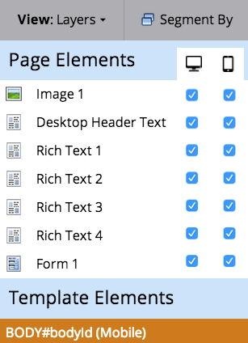

# Personalizza la visualizzazione mobile della pagina di destinazione in formato libero {#customize-mobile-view-for-your-free-form-landing-page}

>[!PREREQUISITES]
>
>[Aggiungere una visualizzazione mobile alla pagina di destinazione in formato libero](/help/marketo/product-docs/demand-generation/landing-pages/free-form-landing-pages/add-a-mobile-view-for-your-free-form-landing-page.md)

La visualizzazione mobile della pagina di destinazione in formato libero è per lo più automatica, ma puoi personalizzarla. Ecco come.

1. Seleziona la pagina di destinazione in formato libero.

   

1. Clic **Modifica bozza**.

   

1. Fai clic su **Dispositivi mobili** scheda.

   

## Visualizzazione mobile e visualizzazione desktop {#mobile-vs-desktop-view}

In Elementi pagina viene visualizzata una  (desktop) e un  (mobile). Questo consente di mostrare/nascondere dinamicamente diversi elementi.

Per impostazione predefinita, tutto ciò che si trova sulla vista desktop viene visualizzato sulla vista mobile.

>[!NOTE]
>
>I rettangoli non vengono visualizzati nella visualizzazione per dispositivi mobili.

## Aspetti importanti da considerare: {#important-things-to-know}

* Le immagini si espanderanno fino alla larghezza del dispositivo mobile. Se desideri immagini più piccole, richiama l’elemento rich-text e aggiungi l’immagine da lì.
* Utilizza solo moduli di Forms 2.0. Sono reattivi e si regolano automaticamente.
* È possibile modificare un solo elemento del modello, BODY#bodyid (Mobile). È possibile utilizzarlo per modificare il colore di sfondo.

  

## Nascondere un elemento dalla vista mobile {#hide-an-element-from-the-mobile-view}

>[!TIP]
>
>Di meno si ottiene invece con i dispositivi mobili. Usa meno parole per clienti più felici.

1. Per nascondere un elemento, fai clic sulla casella di controllo corrispondente sotto la colonna mobile.

   

1. Perfetto! Tale elemento non sarà più visibile nella visualizzazione per dispositivi mobili.

   

## Aggiungere un elemento alla vista mobile {#add-an-element-to-the-mobile-view}

>[!TIP]
>
>Crea contenuti speciali (più brevi) solo per la visualizzazione mobile.

1. Per aggiungere un elemento, trascinalo sulla pagina di destinazione in formato libero.

   

   Assicurati che l’elemento sia impostato per essere visualizzato solo sulla vista mobile.

   

>[!TIP]
>
>La visualizzazione per dispositivi mobili può anche avere una diversa disposizione degli elementi di pagina. Sposta gli elementi nella pagina di destinazione in formato libero o riordina gli oggetti elencati in **Elementi pagina** mediante trascinamento della selezione.

## Anteprima visualizzazione mobile {#preview-mobile-view}

1. Clic **Anteprima bozza**.

   

1. Vuoi vedere qualcosa di figo? Seleziona **Affianca**.

   

1. Ora puoi visualizzare contemporaneamente le versioni desktop e mobile delle pagine di destinazione.

   

1. Se ti piace, fai clic su **Approva e chiudi**.

   

   >[!NOTE]
   >
   >L’anteprima non è interattiva. Ogni smartphone mostra le cose in modo leggermente diverso. Consigliamo di visualizzare l’anteprima della pagina di destinazione su alcuni dispositivi per vedere esattamente come si comporta.

Divertitevi!

>[!MORELIKETHIS]
>
>[Rendi compatibile con dispositivi mobili un modello di pagina di destinazione in formato libero esistente](/help/marketo/product-docs/demand-generation/landing-pages/landing-page-templates/make-an-existing-free-form-landing-page-template-mobile-compatible.md)
