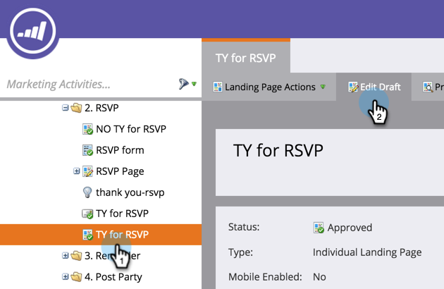

# Usa guide per la progettazione gratuita di una pagina di destinazione {#use-guides-for-free-form-landing-page-design}

Durante la progettazione di una pagina di destinazione in formato libero, puoi utilizzare le guide per facilitare l’allineamento dei componenti.

>[!NOTE]
>
>Le guide sono disponibili solo sul **Forma libera** editor di pagine di destinazione.

1. Seleziona una **Pagina di destinazione** e fai clic su **Modifica bozza**.

   

1. Fai clic su **Azioni pagina di destinazione** e seleziona **Mostra guide**.

   

1. Una guida verticale e orizzontale verrà visualizzata sull&#39;area di lavoro. Usa il cursore per spostarle.

   

1. Trascinare un oggetto sulla linea. Lasciare andare quando la linea raddoppia in larghezza e l&#39;oggetto si aggancia alla guida.

   

   Gli oggetti allineati sono facili agli occhi!
