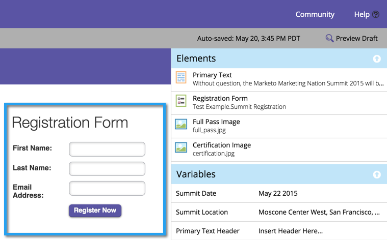

# Aggiungere un modulo a una pagina di destinazione guidata {#add-a-form-to-a-guided-landing-page}

Modulo, incontra la pagina di destinazione. Pagina di destinazione, modulo di incontro.

>[!PREREQUISITES]
>
>[Crea una pagina di destinazione guidata](/help/marketo/product-docs/demand-generation/landing-pages/guided-landing-pages/create-a-guided-landing-page.md)

1. Passare all&#39;area **[!UICONTROL Marketing Activities]**.

   

1. Trovare e selezionare la pagina di destinazione e fare clic su **[!UICONTROL Edit Draft]**.

   

   >[!NOTE]
   >
   >Gli elementi disponibili nelle pagine di destinazione guidate sono definiti dal modello. Se non trovi un modulo nel pannello elementi, seleziona un nuovo modello o contatta l’autore del modello.

1. Fare doppio clic su **Modulo** nel pannello degli elementi.

   

1. Selezionare il modulo da aggiungere.

   

1. Nella scelta della pagina di follow-up sono disponibili tre opzioni:

   * **[!UICONTROL Landing Page]** - scegli una pagina di destinazione di Marketo
   * **[!UICONTROL External URL]** - scegli un URL qualsiasi
   * **[!UICONTROL Form Defined]** - utilizza le impostazioni definite a livello di modulo

   >[!NOTE]
   >
   >La pagina di follow-up è la pagina che le persone vedranno dopo aver inviato il modulo.

1. In questo esempio utilizzeremo [!UICONTROL Form Defined]. Fai clic su **[!UICONTROL Insert]**.

   

   Ben fatto!

   

Ora chiudi l&#39;editor della pagina di destinazione e [approva la bozza della pagina di destinazione](/help/marketo/product-docs/demand-generation/landing-pages/understanding-landing-pages/approve-unapprove-or-delete-a-landing-page.md).
