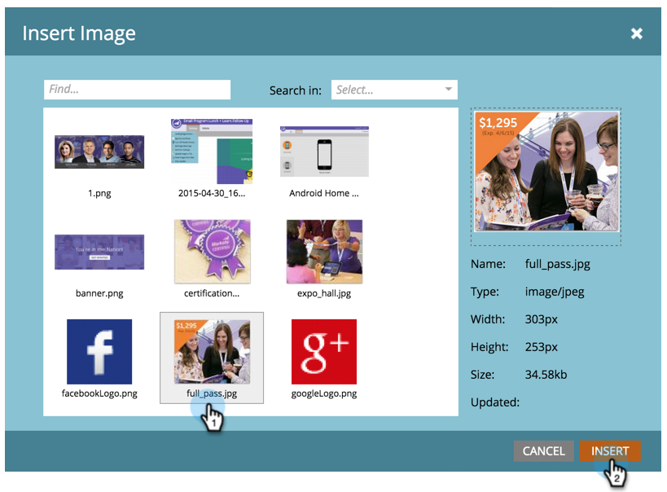

# Aggiungere un’immagine a una pagina di destinazione in formato guidato {#add-an-image-to-a-guided-landing-page}

A differenza delle pagine di destinazione in formato libero, le pagine di destinazione guidate dispongono di spazi predefiniti e bloccati in cui aggiungere immagini.

1. Seleziona una pagina di destinazione guidata. Fai clic su **[!UICONTROL Edit Draft]**.

   

1. Fare clic sull&#39;immagine da modificare. Il segnaposto dell’elemento si illumina nell’area di lavoro della pagina di destinazione.

   

1. Selezionare l&#39;immagine desiderata e fare clic su **[!UICONTROL Insert]**.

   

1. Il contenuto verrà visualizzato nel segnaposto dell’elemento.

   >[!NOTE]
   >
   >Il modo in cui l’immagine viene ridimensionata dipende dal modello. Ulteriori informazioni su [Modelli di pagina di destinazione guidata](/help/marketo/product-docs/demand-generation/landing-pages/landing-page-templates/create-a-guided-landing-page-template.md).

   

   >[!TIP]
   >
   >Al momento, la specifica di un collegamento per un’immagine nell’editor non è supportata. Utilizza invece un elemento Rich Text.
