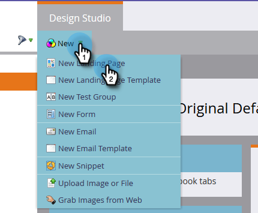

# Creare una pagina di destinazione guidata {#create-a-guided-landing-page}

>[!NOTE]
>
>Le modalità della pagina di destinazione sono definite dal relativo modello. [Ulteriori](/help/marketo/product-docs/demand-generation/landing-pages/understanding-landing-pages/understanding-free-form-vs-guided-landing-pages.md) informazioni sui modelli di pagina di destinazione guidati e a forma libera.

>[!PREREQUISITES]
>
>Per utilizzare un modello personalizzato, è innanzitutto necessario [creare un modello](/help/marketo/product-docs/demand-generation/landing-pages/landing-page-templates/create-a-guided-landing-page-template.md)di pagina di destinazione guidato.

## Creare una pagina di destinazione guidata in un programma {#create-a-guided-landing-page-in-a-program}

Le pagine di destinazione guidate possono essere create come risorse locali di un programma o in Design Studio da utilizzare a livello globale.

1. Vai a Attività **** di marketing.

   

1. Selezionare il programma.

   

1. Fare clic sul menu a discesa **Nuovo** . Selezionate **Nuova risorsa** locale.

   

1. Selezionate **Pagina** di destinazione.

   

1. Denominate la pagina di destinazione. Fate clic sul menu a discesa **Modello** e selezionate Modello **** guidato.

   >[!NOTE]
   >
   >Accanto ai modelli delle pagine di destinazione guidate è presente l’icona  . I modelli guidati sono strutturati in modo che possano rimanere pienamente reattivi.

   

## Creare una pagina di destinazione in Design Studio {#create-a-landing-page-in-design-studio}

1. Andate a **Design Studio**.

   

1. Fare clic sul menu a discesa **Nuovo** . Selezionate **Nuova pagina** di destinazione.

   

1. Denominate la pagina di destinazione. Fate clic sul menu a discesa **Modello** e selezionate Modello **** guidato.

   

1. Fate clic su **Crea**.

   

>[!TIP]
>
>L&#39;URL viene creato automaticamente dai nomi del programma e della pagina di destinazione. Per modificare l’URL, modificate il campo URL **** pagina.
>
>Deselezionate la casella **Apri nell’editor** se non desiderate che l’editor si apra subito dopo aver fatto clic su **Crea**.
