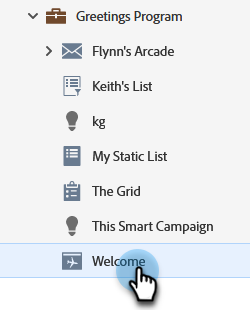

# Modificare l’URL della pagina di destinazione {#change-the-landing-page-url}

Puoi modificare l’URL di una pagina di destinazione. Questo può aiutare a rendere l’URL più facile da ricordare e migliorare la SEO (Search Engine Optimization).

1. Trova e seleziona la pagina di destinazione desiderata.

   

1. Fai clic sul menu a discesa **Azioni pagina di destinazione**, scorri fino a **Strumenti URL** e seleziona **Impostazioni URL**.

   

1. Immettere **[!UICONTROL New URL]**, scegliere di eliminare o reindirizzare il vecchio URL e fare clic su **[!UICONTROL Save]**.

   

   >[!NOTE]
   >
   >Se decidi di mantenere entrambi gli URL, verrà creata automaticamente una regola di reindirizzamento. Ulteriori informazioni sui [reindirizzamenti URL](/help/marketo/product-docs/demand-generation/landing-pages/personalizing-landing-pages/redirect-a-url-path.md).
