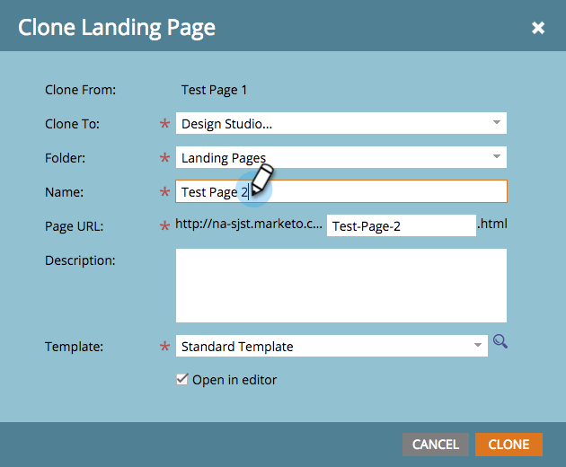
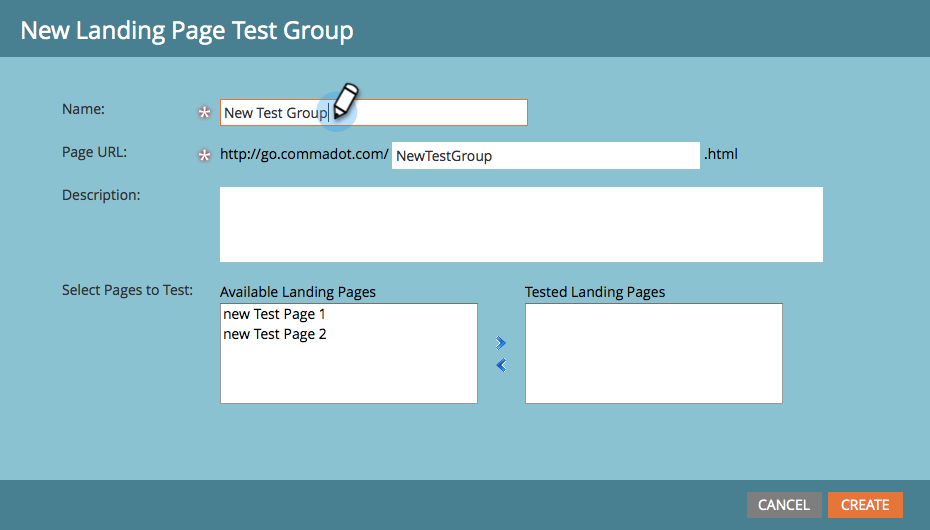

# Clonazione di un gruppo di test di una pagina di destinazione {#cloning-a-landing-page-test-group}

Da [!UICONTROL Design Studio], puoi trovare e duplicare un gruppo di test di una pagina di destinazione.

1. Fare clic con il pulsante destro del mouse su una pagina non approvata. Seleziona **[!UICONTROL Clone]**.

   

1. Assegna un nuovo **[!UICONTROL Name]** alla pagina clonata. Le pagine clonate vengono visualizzate nella parte inferiore della cartella corrente.

   

1. Creare un nuovo gruppo di test facendo clic su **[!UICONTROL New]** e scegliendo **[!UICONTROL New Test Group]**.

   

1. Nella finestra di dialogo Crea nuove pagine di destinazione immettere il nuovo gruppo di test **[!UICONTROL Name]**.

   

1. Nella parte inferiore della finestra di dialogo, selezionare le pagine clonate nell&#39;elenco **[!UICONTROL Available Landing Pages]** e fare clic sulla freccia rivolta a destra per includerle in **[!UICONTROL Tested Landing Pages]**. Esegui questa operazione per tutte le pagine di destinazione che desideri nel gruppo.

   

1. Al termine, fare clic su **[!UICONTROL Create]**.

   

1. Quando si è pronti per avviare il gruppo di test, fare clic con il pulsante destro del mouse sul gruppo nella struttura e scegliere **[!UICONTROL Approve Test Group]**.

   

   Ora il gruppo tiene traccia delle visite e dei completamenti dei moduli in modo da poter vedere quale pagina di destinazione offre le prestazioni migliori.
