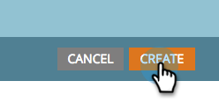

# Clonazione di un gruppo di test per una pagina di destinazione {#cloning-a-landing-page-test-group}

In Design Studio è possibile trovare e duplicare un gruppo di test della pagina di destinazione.

1. Fai clic con il pulsante destro del mouse su una pagina non approvata. Seleziona **Clona**.

   

1. Assegna una nuova pagina clonata **Nome**. Le pagine clonate vengono visualizzate nella parte inferiore della cartella corrente.

   

1. Crea un nuovo gruppo di test facendo clic su **Nuovo** e prelievo **Nuovo gruppo di test**.

   

1. Nella finestra di dialogo Crea nuove pagine di destinazione, immetti il nuovo gruppo di test **Nome**.

   

1. Nella parte inferiore della finestra di dialogo, seleziona le pagine clonate nel **Pagine di destinazione disponibili** e fai clic sulla freccia rivolta a destra per includerla nell&#39;elenco **Pagine di destinazione testate**. Effettua questa operazione per tutte le pagine di destinazione desiderate nel gruppo.

   

1. Al termine, fai clic su **Crea**.

   

1. Quando sei pronto per avviare il gruppo di test, fai clic con il pulsante destro del mouse sul gruppo nella struttura e scegli **Approva gruppo di test**.

   

   Il gruppo ora terrà traccia attiva delle visite e delle completamenti del modulo, in modo da poter vedere quale pagina di destinazione funziona meglio.
