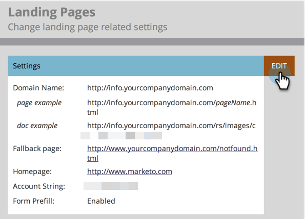
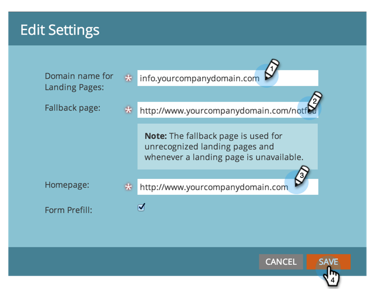

# Personalizzare gli URL della pagina di destinazione con un CNAME {#customize-your-landing-page-urls-with-a-cname}

Anche se Marketo ospita le tue pagine di destinazione, l’URL può essere completamente personalizzato. Come si presenta senza un CNAME:

`https://na-sj02.marketo.com/lp/mktodemoaccount126/UnsubscribePage.html`

Il suo aspetto:

`https://go.YourCompany.com/UnsubscribePage.html`

## Scegli un CNAME {#choose-a-cname}

Scegli una parola all’inizio dell’URL per le pagine di destinazione. È solo una parola e dovrebbe essere relativamente breve. Esempi:

* go.YourCompany.com/NameOfPage.html
* info.YourCompany.com/NameOfPage.html
* pages.YourCompany.com/NameOfPage.html

L’unica parola (più YourCompany.com) è denominata CNAME. Ne avrai bisogno più tardi, quindi prendi nota.

## Trova il tuo Munchkin ID {#find-your-munchkin-id}

1. Vai all&#39;area **Amministratore**.

   

1. Fai clic su **Il mio account**.

   

   >[!NOTE]
   >
   >**Autorizzazioni amministratore richieste**

1. Scorri verso il basso fino a &quot;Informazioni di supporto&quot; e copia il tuo Munchkin ID.

   

## Invia richiesta al reparto IT {#send-request-to-it}

Chiedi al tuo personale IT di configurare il seguente CNAME: (sostituisci la parola [CNAME] e [Munchkin ID] con il testo del passaggio precedente).

[CNAME].YourCompany.com > [Munchkin ID].mktoweb.com

## Completare l’impostazione di CNAME {#complete-cname-setup}

1. Una volta creato il CNAME da parte del reparto IT, vai all&#39;area **Amministratore**.

   

1. Fai clic su **Pagine di destinazione**.

   

1. Nella sezione **Impostazioni**, fai clic su **Modifica**.

   

1. Immetti il tuo CNAME in **[!UICONTROL Domain name for Landing Pages]**, immetti il tuo **[!UICONTROL Fallback page]**, immetti il tuo **[!UICONTROL Homepage]** e fai clic su **[!UICONTROL Save]**.

   

>[!NOTE]
>
>La pagina di fallback sarà quella a cui verranno reindirizzati i lead di pagina se la pagina di destinazione di Marketo non è disponibile.

Bel lavoro! Le pagine di destinazione ora sono contrassegnate con il dominio della tua azienda.
