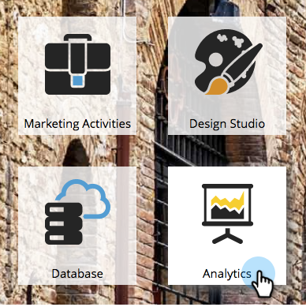
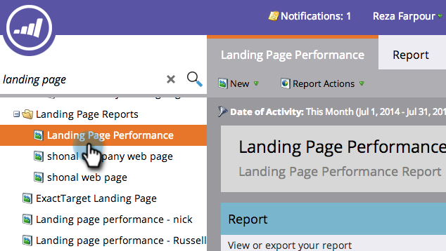
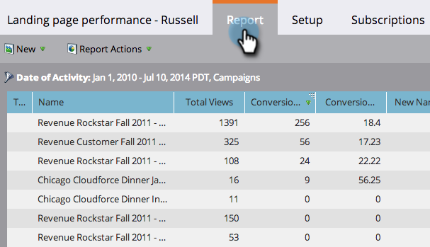

# Filtrare un rapporto sulle prestazioni di una pagina di destinazione {#filter-a-landing-page-performance-report}

Concentrare il [rapporto sulle prestazioni della pagina di destinazione](/help/marketo/product-docs/demand-generation/landing-pages/understanding-landing-pages/landing-page-performance-report.md) sulle pagine di destinazione nei programmi (risorse locali), su quelle in [!UICONTROL Design Studio] (risorse globali) o su quelle che sono state archiviate.

1. Vai a **[!UICONTROL Analytics]** (o **[!UICONTROL Marketing Activities]**).

   

1. Seleziona il rapporto della pagina di destinazione dalla struttura di navigazione.

   

1. Fare clic sulla scheda **[!UICONTROL Setup]** e trascinare un filtro.

   

   * **[!UICONTROL Design Studio Landing Pages]:** risorse globali, gestite in [!UICONTROL Design Studio].
   * **[!UICONTROL Marketing Activities Landing Pages]:** risorse locali nei programmi nella scheda [!UICONTROL Marketing Activities].
   * **[!UICONTROL Archived Landing Pages]:** pagine di destinazione inattive, ritirate.

1. Scegli le cartelle e le pagine di destinazione specifiche da includere nel rapporto.

   

   >[!TIP]
   >
   >Se selezioni una cartella, il rapporto includerà tutto ciò che la cartella contiene al momento dell’esecuzione del rapporto.

1. Hai finito! Fare clic sulla scheda **[!UICONTROL Report]** per visualizzare il report filtrato.

   
