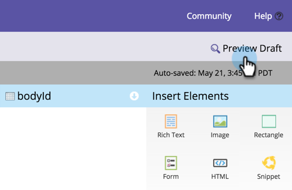

# Visualizzaare in anteprima una pagina di destinazione {#preview-a-landing-page}

Probabilmente vorrai vedere come si presenta la pagina di destinazione prima di pubblicarla.

## Visualizzaare in anteprima una pagina di destinazione {#preview-a-landing-page-1}

1. Selezionare una pagina di destinazione e fare clic su **[!UICONTROL Preview Page]**.

   

   >[!NOTE]
   >
   >La bozza è la versione su cui stai lavorando, non quella live visualizzata dai clienti.

1. Puoi anche fare clic con il pulsante destro del mouse sulla pagina di destinazione e selezionare **[!UICONTROL Preview]**.

   

## Anteprima di una bozza di pagina di destinazione {#preview-a-landing-page-draft}

1. Fare clic con il pulsante destro del mouse su una pagina di destinazione approvata con una versione bozza e scegliere **[!UICONTROL Preview Draft]**.

   

## Anteprima di una bozza di pagina di destinazione durante la modifica {#preview-a-landing-page-draft-while-editing}

1. Selezionare una pagina di destinazione e fare clic su **[!UICONTROL Edit Draft]**.

   

1. In qualsiasi momento durante il lavoro nell&#39;editor pagina di destinazione, puoi fare clic su **[!UICONTROL Preview Draft]**.

   

1. È possibile tornare rapidamente alla modifica facendo clic su **[!UICONTROL Edit Draft]**.

   

Ottimo lavoro. Ora sai come visualizzare in anteprima le pagine di destinazione.
